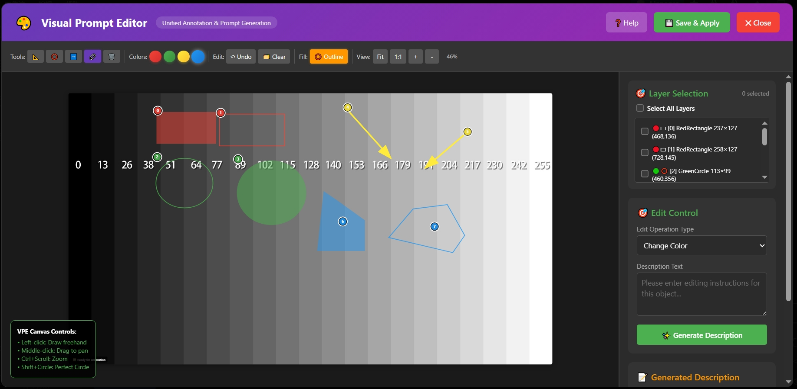

# Kontext 可视化提示词窗口



🎨 渐进式智能图像编辑系统，通过三个发展阶段逐步实现从**手动标注**到**智能分割**再到**专业调色**的完整工作流。

## 产品发展路线图

### 🚀 第一阶段：手动标注与基础提示词
**当前实现状态**: ✅ **已完成**

#### 核心功能
- **🎨 自由手动标注**
  - 矩形、圆形、箭头、多边形绘制工具
  - 实心/空心样式切换
  - 多颜色支持和多选功能
  - 完整的编辑、撤销、清空功能
  - 🏷️ **编号控制**: 可选择是否在标注和提示词中显示编号

- **📝 结构化提示词输出**
  - 基于标注区域的基础提示词模板
  - 12种操作类型支持（颜色变换、风格转换等）
  - 自定义编辑描述输入
  - 质量分析和优化建议

- **🎯 掩码数据输出**
  - 标注转ComfyUI掩码格式
  - 多种掩码模式（选中图层、全部图层、反选）
  - 羽化边缘处理

### 🔮 第二阶段：智能分割与AI提示词
**开发状态**: 🚧 **规划中**

#### 计划功能
- **🤖 语义分割自动标注**
  - 集成先进的分割模型（SAM、GroundingDINO等）
  - 自动识别并生成可选图层标注
  - 智能物体识别和分类
  - 一键全图语义分割

- **🧠 大语言模型提示词生成**
  - 集成ChatGPT/DeepSeek等大模型
  - 基于图像内容的智能提示词生成
  - 上下文感知的编辑建议
  - 多语言提示词支持

- **📝 结构化提示词优化与调试**
  - 深度优化Kontext专用提示词模板
  - 五维结构化提示词体系：对象+操作+参数+修饰+约束
  - 智能提示词质量评估和优化建议
  - A/B测试框架，寻找最适合的提示词模式

### ✨ 第三阶段：专业调色与环境调整
**开发状态**: 📋 **概念设计**

#### 愿景功能
- **🎨 专业调色系统**
  - 色温调节（冷暖色调平衡）
  - 色调映射和颜色校正
  - 亮度、对比度、饱和度精细控制
  - HSL颜色空间专业调节

- **🌅 环境光线系统**
  - 智能光线分析和重建
  - 环境光、主光、补光独立调节
  - 阴影和高光细节恢复
  - 真实感光线效果模拟

- **🎭 风格转换引擎**
  - 艺术风格迁移（油画、水彩、素描等）
  - 摄影风格模拟（胶片、数码、黑白等）
  - 自定义风格训练和应用

## 第一阶段功能详情

### 🔧 绘制工具
- **矩形**: 拖拽绘制矩形标注
- **圆形**: 拖拽绘制椭圆，Shift键绘制正圆
- **箭头**: 拖拽绘制指向箭头
- **自由绘制**: 左击添加锚点，右击闭合多边形
- **橡皮擦**: 点击删除标注

### 🎨 样式选项
- **颜色选择**: 红、绿、黄、蓝四种颜色
- **填充模式**: 实心/空心切换
- **多选支持**: 同时选择多个标注对象
- **🏷️ 编号控制**: 勾选框控制编号显示（前端标注编号和后端图像编号同步）

### 📝 提示词模板
- **颜色变换**: 改变选中区域的颜色
- **风格转换**: 应用艺术风格到选中区域
- **背景替换**: 替换选中区域的背景
- **物体替换**: 替换选中的物体
- **物体移除**: 移除选中的物体
- **质感修改**: 改变表面质感
- **姿态调整**: 调整人物姿态
- **表情修改**: 修改面部表情
- **服装更换**: 更换服装样式
- **环境修改**: 修改环境设定
- **质量增强**: 提升图像质量
- **自定义操作**: 用户自定义编辑指令

## 结构化提示词体系（第二阶段预览）

### 🏗️ 五维提示词结构
Kontext专用的结构化提示词遵循五个核心维度，确保精确、可控的图像编辑效果：

#### 📍 1. 对象（Object）
- **定义**: 明确指定要编辑的区域或对象
- **格式**: `the [颜色] [形状] marked area (annotation [编号])`
- **示例**: `the red rectangular marked area (annotation 1)`

#### ⚙️ 2. 操作类型（Operation）
- **定义**: 具体的编辑动作类型
- **类型**: 
  - `change_color` - 颜色变换
  - `replace_object` - 物体替换
  - `remove_object` - 物体移除
  - `change_style` - 风格转换
  - `change_texture` - 质感修改

#### 🎯 3. 参数（Parameters）
- **定义**: 操作的具体目标值或描述
- **格式**: 用户输入的目标描述
- **示例**: `"red color"`, `"cartoon style"`, `"smooth texture"`

#### ✨ 4. 修饰（Modifiers）
- **定义**: 可选的质量增强词汇（用户控制）
- **类型**: 
  - 质量修饰: `high quality`, `8k resolution`, `professional`
  - 风格修饰: `realistic`, `artistic`, `photorealistic`
  - 技术修饰: `sharp focus`, `detailed`, `masterpiece`

#### 🔒 5. 约束（Constraints）
- **定义**: 可选的限制条件（用户控制）
- **类型**:
  - 保持约束: `maintaining lighting`, `preserving composition`
  - 集成约束: `natural integration`, `seamless blending`
  - 一致性约束: `consistent style`, `matching perspective`

### 📝 提示词生成示例

#### 基础版本（第一阶段，当前实现）
```
输入: 对象="红色矩形区域", 操作="变色", 参数="蓝色"
输出: "Change the color of the red marked area to blue"
```

#### 优化版本（第二阶段，规划中）
```
输入: 
- 对象="红色矩形区域" 
- 操作="变色" 
- 参数="蓝色"
- 修饰="高质量，专业"
- 约束="保持光照，自然融合"

输出: "Change the color of the red rectangular marked area to blue, high quality, professional, maintaining lighting, natural integration"
```

### 🎯 用户控制原则
- **默认简洁**: 系统默认只生成核心结构（对象+操作+参数）
- **用户选择**: 修饰词和约束词完全由用户决定是否添加
- **模板优化**: 通过AI测试找到最适合不同模型的提示词模板
- **质量评估**: 自动分析提示词质量并提供优化建议

## 安装使用

### 📦 安装

#### 方式一：Git安装（推荐）
```bash
cd ComfyUI/custom_nodes
git clone https://github.com/aiaiaikkk/KontextVisualPromptWindow.git
```

#### 方式二：手动安装
1. 下载并解压项目文件
2. 将整个`KontextVisualPromptWindow`文件夹复制到`ComfyUI/custom_nodes/`目录

#### 完成安装
重启ComfyUI即可使用

### 🚀 使用方法

#### 第一阶段工作流（当前版本）

##### 基础模式（推荐）
```
LoadImage → VisualPromptEditor
```
- **功能**: 手动标注 + 基础提示词生成
- **适用**: 精确控制标注，适合专业用户

##### 完整模式
```
LoadImage → VisualPromptEditor → LayerToMaskNode
```
- **功能**: 手动标注 + 提示词 + 掩码输出
- **适用**: 需要掩码数据用于后续ComfyUI工作流

#### 第二阶段工作流（规划中）

##### 智能分割模式
```
LoadImage → SemanticSegmentationNode → VisualPromptEditor → AIPromptGenerator
```
- **功能**: 自动分割 + 手动调整 + AI提示词
- **适用**: 快速处理，适合批量编辑

##### 提示词优化模式
```
LoadImage → VisualPromptEditor → PromptOptimizer → QualityAnalyzer
```
- **功能**: 手动标注 + 结构化提示词优化 + 质量评估
- **适用**: 专业用户，追求最佳提示词效果

#### 第三阶段工作流（概念中）

##### 专业调色模式
```
LoadImage → GlobalColorGrading → LocalAnnotationEditing → ProfessionalLightingAdjustment
```
- **功能**: 全图调色 + 局部编辑 + 光线调整
- **适用**: 专业摄影师和设计师

### 🎯 操作指南

#### 基本操作
1. **打开编辑器**: 双击`VisualPromptEditor`节点
2. **选择工具**: 点击工具栏中的绘制工具
3. **选择颜色**: 点击颜色按钮选择标注颜色
4. **切换样式**: 点击"Fill"按钮切换实心/空心
5. **编号控制**: 勾选/取消"Include annotation numbers"控制编号显示
6. **绘制标注**: 在图像上拖拽或点击绘制
7. **保存应用**: 点击"Save & Apply"保存数据

#### 快捷键
- **Ctrl + 滚轮**: 缩放图像
- **中键拖拽**: 平移图像
- **Shift + 圆形**: 绘制正圆
- **右键**: 结束自由绘制

## 节点说明

### 🎨 VisualPromptEditor
**主要节点**
- **输入**: IMAGE
- **输出**: 处理后图像、提示词、掩码数据等
- **功能**: 可视化标注编辑和提示词生成

### 🤖 IntelligentAnnotationNode
**智能标注节点**
- **输入**: IMAGE
- **输出**: 检测到的图层数据JSON
- **功能**: 自动对象检测和区域分割

### 🎭 LayerToMaskNode
**图层转掩码节点**
- **输入**: 图层数据JSON
- **输出**: ComfyUI掩码格式
- **功能**: 标注数据转换为掩码


## 许可证

MIT License - 详见LICENSE文件

## 支持

如有问题或建议，请在GitHub仓库中提交Issue。

---

🌟 **Kontext Visual Prompt Window** - 让图像编辑更智能、更直观！

---

# Kontext Visual Prompt Window


🎨 A progressive intelligent image editing system that evolves through three development stages from **manual annotation** to **intelligent segmentation** to **professional color grading**.

## Product Development Roadmap

### 🚀 Stage 1: Manual Annotation & Basic Prompts
**Current Implementation Status**: ✅ **Completed**

#### Core Features
- **🎨 Free Manual Annotation**
  - Rectangle, circle, arrow, polygon drawing tools
  - Toggle between filled/outline styles
  - Multi-color support and multi-selection
  - Complete editing, undo, clear functionality
  - 🏷️ **Number Control**: Optional display of annotation numbers in annotations and prompts

- **📝 Structured Prompt Output**
  - Basic prompt templates based on annotated regions
  - 12 operation types (color transformation, style transfer, etc.)
  - Custom editing description input
  - Quality analysis and optimization suggestions

- **🎯 Mask Data Output**
  - Convert annotations to ComfyUI mask format
  - Multiple mask modes (selected layers, all layers, inverted)
  - Feathered edge processing

### 🔮 Stage 2: Intelligent Segmentation & AI Prompts
**Development Status**: 🚧 **In Planning**

#### Planned Features
- **🤖 Semantic Segmentation Auto-annotation**
  - Integrate advanced segmentation models (SAM, GroundingDINO, etc.)
  - Automatically identify and generate selectable layer annotations
  - Intelligent object recognition and classification
  - One-click full image semantic segmentation

- **🧠 LLM-powered Prompt Generation**
  - Integrate ChatGPT/DeepSeek and other LLMs
  - Intelligent prompt generation based on image content
  - Context-aware editing suggestions
  - Multi-language prompt support

- **📝 Structured Prompt Optimization & Debugging**
  - Deep optimization of Kontext-specific prompt templates
  - Five-dimensional structured prompt system: Object + Operation + Parameters + Modifiers + Constraints
  - Intelligent prompt quality assessment and optimization suggestions
  - A/B testing framework to find optimal prompt patterns

### ✨ Stage 3: Professional Color Grading & Environmental Adjustment
**Development Status**: 📋 **Conceptual Design**

#### Vision Features
- **🎨 Professional Color Grading System**
  - Color temperature adjustment (cool/warm balance)
  - Tone mapping and color correction
  - Fine control of brightness, contrast, saturation
  - Professional HSL color space adjustment

- **🌅 Environmental Lighting System**
  - Intelligent lighting analysis and reconstruction
  - Independent control of ambient, key, and fill lighting
  - Shadow and highlight detail recovery
  - Realistic lighting effect simulation

- **🎭 Style Transfer Engine**
  - Artistic style transfer (oil painting, watercolor, sketch, etc.)
  - Photography style simulation (film, digital, black & white, etc.)
  - Custom style training and application

## Stage 1 Feature Details

### 🔧 Drawing Tools
- **Rectangle**: Drag to draw rectangular annotations
- **Circle**: Drag to draw ellipse, Shift for perfect circle
- **Arrow**: Drag to draw directional arrows
- **Freehand**: Left-click to add anchor points, right-click to close polygon
- **Eraser**: Click to delete annotations

### 🎨 Style Options
- **Color Selection**: Red, green, yellow, blue colors
- **Fill Mode**: Toggle between filled/outline styles
- **Multi-selection**: Select multiple annotation objects simultaneously
- **🏷️ Number Control**: Checkbox to control number display (frontend annotation numbers and backend image numbers synchronized)

### 📝 Prompt Templates
- **Color Change**: Change color of selected area
- **Style Transfer**: Apply artistic style to selected area
- **Background Replace**: Replace background of selected area
- **Object Replace**: Replace selected object
- **Object Remove**: Remove selected object
- **Texture Change**: Change surface texture
- **Pose Change**: Adjust character pose
- **Expression Change**: Modify facial expression
- **Clothing Change**: Change clothing style
- **Environment Change**: Modify environment setting
- **Quality Enhancement**: Enhance image quality
- **Custom Operation**: User-defined editing instructions

## Installation & Usage

### 📦 Installation

#### Method 1: Git Installation (Recommended)
```bash
cd ComfyUI/custom_nodes
git clone https://github.com/aiaiaikkk/KontextVisualPromptWindow.git
```

#### Method 2: Manual Installation
1. Download and extract the project files
2. Copy the entire `KontextVisualPromptWindow` folder to `ComfyUI/custom_nodes/` directory

#### Complete Installation
Restart ComfyUI to use the plugin

### 🚀 Usage

#### Stage 1 Workflow (Current Version)

##### Basic Mode (Recommended)
```
LoadImage → VisualPromptEditor
```
- **Features**: Manual annotation + basic prompt generation
- **Suitable for**: Precise annotation control, suitable for professional users

##### Complete Mode
```
LoadImage → VisualPromptEditor → LayerToMaskNode
```
- **Features**: Manual annotation + prompts + mask output
- **Suitable for**: Requires mask data for subsequent ComfyUI workflow

#### Stage 2 Workflow (Planned)

##### Intelligent Segmentation Mode
```
LoadImage → SemanticSegmentationNode → VisualPromptEditor → AIPromptGenerator
```
- **Features**: Auto segmentation + manual adjustment + AI prompts
- **Suitable for**: Rapid processing, suitable for batch editing

##### Prompt Optimization Mode
```
LoadImage → VisualPromptEditor → PromptOptimizer → QualityAnalyzer
```
- **Features**: Manual annotation + structured prompt optimization + quality assessment
- **Suitable for**: Professional users seeking optimal prompt effectiveness

#### Stage 3 Workflow (Conceptual)

##### Professional Grading Mode
```
LoadImage → GlobalColorGrading → LocalAnnotationEditing → ProfessionalLightingAdjustment
```
- **Features**: Global grading + local editing + lighting adjustment
- **Suitable for**: Professional photographers and designers

### 🎯 Operation Guide

#### Basic Operations
1. **Open Editor**: Double-click the `VisualPromptEditor` node
2. **Select Tool**: Click drawing tools in toolbar
3. **Select Color**: Click color buttons to select annotation color
4. **Toggle Style**: Click "Fill" button to toggle filled/outline
5. **Number Control**: Check/uncheck "Include annotation numbers" to control number display
6. **Draw Annotation**: Drag or click on image to draw
7. **Save & Apply**: Click "Save & Apply" to save data

#### Keyboard Shortcuts
- **Ctrl + Scroll**: Zoom image
- **Middle-click drag**: Pan image
- **Shift + Circle**: Draw perfect circle
- **Right-click**: Finish freehand drawing

## Node Description

### 🎨 VisualPromptEditor
**Main Node**
- **Input**: IMAGE
- **Output**: Processed image, prompts, mask data, etc.
- **Function**: Visual annotation editing and prompt generation

### 🤖 IntelligentAnnotationNode
**Intelligent Annotation Node**
- **Input**: IMAGE
- **Output**: Detected layer data JSON
- **Function**: Automatic object detection and region segmentation

### 🎭 LayerToMaskNode
**Layer to Mask Node**
- **Input**: Layer data JSON
- **Output**: ComfyUI mask format
- **Function**: Convert annotation data to masks


## License

MIT License - See LICENSE file for details

## Support

For issues or suggestions, please submit an Issue in the GitHub repository.

---

🌟 **Kontext Visual Prompt Window** - Making image editing smarter and more intuitive!