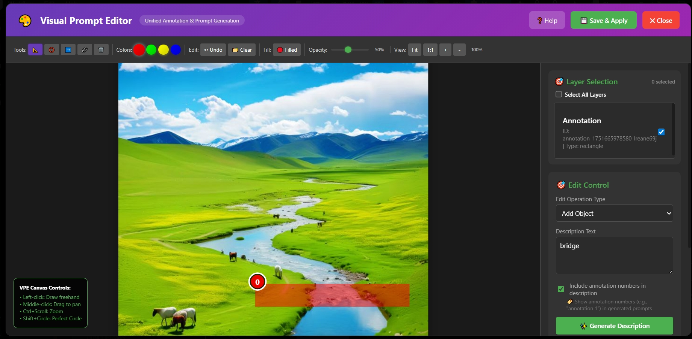

# Kontext Visual Prompt Window

**[🇨🇳 中文文档](#chinese-docs) | [🇺🇸 English Docs](#english-docs)**

---

## <a id="chinese-docs"></a>🇨🇳 中文文档

**多模态提示词输入框** - 智能的视觉提示词生成系统，为ComfyUI提供**可视化标注**与**结构化提示词生成**的完美结合，专为Flux Kontext工作流优化。这是一个革命性的**多模态AI提示词输入界面**，将视觉理解与文本生成无缝集成。

## 🎯 效果展示

| 使用前 | 使用后 |
|--------|--------|
|  |  |
| 传统文本提示词输入 | 多模态可视化提示词生成 |
**近期更新内容展示：**
**1.编辑窗口优化，支持多图层使用不同指令。根据官方数据集更新提示词预设**


**2.支持本地调用本地ollama服务生成提示词**

**3.支持API远程调用大语言模型生成提示词**


### 💫 快速上手

1. **双击节点** → 打开可视化编辑器
2. **绘制标注** → 选择工具标记目标区域  
3. **选择模板** → 选择操作类型和增强提示词
4. **一键生成** → 自动生成结构化提示词

### 🎯 项目目标

本项目旨在构建一个基于 **Flux Kontext 大模型** 的可视化 + 结构化图像编辑系统，通过直观的图形标注与自然语言提示的协同控制，实现对图像的精细化、多模态编辑。

用户无需掌握复杂的提示词编写，仅需 **框选图像区域 + 描述意图**，系统即可自动生成结构化编辑指令，驱动 Kontext 模型完成图像局部/整体的智能修改操作。

本项目力求实现：

🖼️ **所见即所得的可视化交互**：支持矩形、圆形、箭头、自由绘图等多种标注方式；

✍️ **结构化提示词自动拼接与补全**：帮助小白用户高效表达编辑需求；

🧠 **结合大模型的语义理解能力**：精确控制图像的变换、替换、修复与增强；

🔄 **编辑闭环完整打通**：从标注 → 生成掩码 → 提示生成 → 编辑执行 → 回显反馈，全流程自动联动。

目标是打造一个适用于 **ComfyUI 图像创作生态** 的通用可视化指令入口，为 AI 图像编辑提供更加智能、自然、高效的交互方式。

### ✨ 核心特性

#### 🎨 视觉标注系统
- **4种绘制工具**：矩形、圆形、箭头、自由绘制多边形
- **多色彩支持**：红、绿、黄、蓝标注颜色
- **交互式编辑**：点击、拖拽、选择、删除标注
- **实时预览**：图像上的实时标注渲染

#### 📝 多模态结构化提示词生成
- **4个模板分类**：局部编辑、全局调整、文字编辑、专业操作
- **49个优化模板**：基于1025条Flux Kontext官方指令
- **多选提示词**：约束性和修饰性提示词的复选框界面
- **智能组合**：自动将视觉标注转换为多模态AI可理解的结构化提示词


### 🚀 已实现功能

#### ✅ 核心功能
- [x] **可视化提示词编辑器节点** - 双击打开统一界面
- [x] **多工具标注** - 矩形、圆形、箭头、自由绘制
- [x] **4分类模板系统** - 局部/全局/文字/专业操作
- [x] **多选提示词增强** - 约束性/修饰性提示词复选框界面
- [x] **实时模板切换** - 操作类型切换立即更新提示词选项
- [x] **结构化输出生成** - 自动构建包含选中增强词的提示词
- [x] **图像渲染** - 标注直接渲染到输出图像

#### 📈 计划中的高级功能
- [ ] **标注数据导出** - JSON格式的坐标和元数据
- [ ] **多语言支持** - 中英文界面元素
- [ ] **会话持久化** - 保存和恢复标注状态
- [ ] **质量分析** - 提示词评分和优化建议
- [ ] **大语言模型集成** - 接入大语言模型自动生成结构化提示词

#### ✅ 用户体验
- [x] **直观界面** - 左侧画布，右侧提示词面板布局
- [x] **响应式设计** - 自动缩放和缩放控制

### 📋 模板分类

| 分类 | 模板数量 | 描述 |
|------|----------|------|
| 🎯 **局部编辑** | 18个模板 | 特定对象编辑（颜色、样式、纹理、姿势等） |
| 🌍 **全局调整** | 12个模板 | 整体图像处理（调色、增强、滤镜） |
| 📝 **文字编辑** | 5个模板 | 文字操作（添加、删除、编辑、调整大小、组合） |
| 🔧 **专业操作** | 14个模板 | 高级编辑（几何变换、合成等） |

### 🔮 未来规划

#### 📈 计划增强
- [ ] **AI驱动标注** - 自动对象检测和预标注
- [ ] **自定义模板创建器** - 用户定义的提示词模板
- [ ] **批处理** - 多图像标注工作流
- [ ] **模板市场** - 社区共享的提示词模板
- [ ] **高级导出格式** - 支持更多输出格式

#### 🧪 实验性功能
- [ ] **语音标注** - 音频描述转提示词转换
- [ ] **3D对象支持** - 深度感知标注工具
- [ ] **实时协作** - 多用户编辑会话
- [ ] **API集成** - 外部工具连接

### 📦 安装方法

#### 方法一：Git克隆（推荐）
```bash
cd ComfyUI/custom_nodes/
git clone https://github.com/aiaiaikkk/Kontext-Visual-Prompt-Window.git
```

#### 方法二：手动安装
1. 将`KontextVisualPromptWindow`文件夹复制到ComfyUI的custom_nodes目录
2. 重启ComfyUI
3. 在`kontext/core`分类中找到`VisualPromptEditor`节点
4. 双击节点打开可视化编辑器

### 🎮 使用方法

1. **添加节点**：在工作流中放置`VisualPromptEditor`
2. **连接图像**：将图像输入连接到节点
3. **打开编辑器**：双击节点启动界面
4. **标注**：使用绘制工具标记感兴趣的区域
5. **配置**：选择模板分类和操作类型
6. **增强**：通过复选框选择约束性和修饰性提示词
7. **生成**：点击"生成描述"获得结构化提示词
8. **导出**：保存标注并在工作流中使用生成的提示词

### 🔧 系统要求

- ComfyUI（推荐最新版本）
- Python 3.7+
- 支持JavaScript的现代网页浏览器
- 4GB+内存以获得最佳性能

### 📊 项目统计

- **模板数量**：49个Flux Kontext优化模板
- **提示词数据库**：343个约束性和修饰性提示词
- **语言支持**：英文/中文双语界面
- **文件大小**：约2.5MB完整包
- **节点数量**：2个核心节点，追求最大简洁性

---

## <a id="english-docs"></a>🇺🇸 English Documentation

**Multimodal Prompt Input Box** - An intelligent visual prompt generation system for ComfyUI that combines **visual annotation** with **structured prompt generation**, optimized for Flux Kontext workflow. This is a revolutionary **multimodal AI prompt input interface** that seamlessly integrates visual understanding with text generation.

## 🎯 Visual Demonstration

| Before | After |
|--------|-------|
|  |  |
| Traditional text prompt input | Multimodal visual prompt generation |

### 💫 Quick Start

1. **Double-click node** → Open visual editor
2. **Draw annotations** → Select tools to mark target areas
3. **Choose templates** → Select operation type and enhancement prompts  
4. **Generate instantly** → Auto-generate structured prompts

## 🎯 Project Purpose

This project aims to build a visual + structured image editing system based on the **Flux Kontext large model**, achieving fine-grained, multimodal image editing through the collaborative control of intuitive graphic annotation and natural language prompts.

Users don't need to master complex prompt writing - they simply need to **select image regions + describe intentions**, and the system will automatically generate structured editing instructions to drive the Kontext model to complete intelligent local/global image modifications.

This project strives to achieve:

🖼️ **WYSIWYG Visual Interaction**: Support for multiple annotation methods including rectangles, circles, arrows, and freehand drawing;

✍️ **Automated Structured Prompt Assembly and Completion**: Help novice users efficiently express editing requirements;

🧠 **Integration with Large Model Semantic Understanding**: Precise control over image transformation, replacement, repair, and enhancement;

🔄 **Complete Editing Loop Integration**: From annotation → mask generation → prompt generation → editing execution → feedback display, full-process automatic coordination.

The goal is to create a universal visual command interface suitable for the **ComfyUI image creation ecosystem**, providing a more intelligent, natural, and efficient interaction method for AI image editing.

## ✨ Key Features

### 🎨 Visual Annotation System
- **4 Drawing Tools**: Rectangle, Circle, Arrow, Freehand Polygon
- **Multi-color Support**: Red, Green, Yellow, Blue annotations
- **Interactive Editing**: Click, drag, select, delete annotations
- **Real-time Preview**: Live annotation rendering on images

### 📝 Multimodal Structured Prompt Generation
- **4 Template Categories**: Local Edits, Global Adjustments, Text Editing, Professional Operations
- **49 Optimized Templates**: Based on 1025 official Flux Kontext instructions
- **Multi-select Prompts**: Checkbox interface for constraint and decorative prompts
- **Smart Combination**: Automatically convert visual annotations into multimodal AI-comprehensible structured prompts


## 🚀 Implemented Features

### ✅ Core Functionality
- [x] **Visual Prompt Editor Node** - Double-click to open unified interface
- [x] **Multi-tool Annotation** - Rectangle, Circle, Arrow, Freehand drawing
- [x] **4-category Template System** - Local/Global/Text/Professional operations
- [x] **Multi-select Prompt Enhancement** - Checkbox interface for constraint/decorative prompts
- [x] **Real-time Template Switching** - Operation type changes instantly update prompt options
- [x] **Structured Output Generation** - Automatic prompt construction with selected enhancements
- [x] **Image Rendering** - Annotations directly rendered to output images

### 📈 Planned Advanced Features
- [ ] **Annotation Data Export** - JSON format with coordinates and metadata
- [ ] **Multi-language Support** - Chinese/English interface elements
- [ ] **Session Persistence** - Save & restore annotation states
- [ ] **Quality Analysis** - Prompt scoring and optimization suggestions
- [ ] **Large Language Model Integration** - Connect to LLMs for automatic structured prompt generation

### ✅ User Experience
- [x] **Intuitive Interface** - Left canvas, right prompt panel layout
- [x] **Responsive Design** - Auto-scaling and zoom controls

## 📋 Template Categories

| Category | Templates | Description |
|----------|-----------|-------------|
| 🎯 **Local Edits** | 18 templates | Object-specific editing (color, style, texture, pose, etc.) |
| 🌍 **Global Adjustments** | 12 templates | Whole image processing (color grading, enhancement, filters) |
| 📝 **Text Editing** | 5 templates | Text manipulation (add, remove, edit, resize, combine) |
| 🔧 **Professional Operations** | 14 templates | Advanced editing (geometric transforms, compositing, etc.) |

## 🔮 Future Roadmap

### 📈 Planned Enhancements
- [ ] **AI-powered Annotation** - Automatic object detection and pre-annotation
- [ ] **Custom Template Creator** - User-defined prompt templates
- [ ] **Batch Processing** - Multiple image annotation workflow
- [ ] **Template Marketplace** - Community-shared prompt templates
- [ ] **Advanced Export Formats** - Support for more output formats

### 🧪 Experimental Features
- [ ] **Voice Annotation** - Audio description to prompt conversion
- [ ] **3D Object Support** - Depth-aware annotation tools
- [ ] **Real-time Collaboration** - Multi-user editing sessions
- [ ] **API Integration** - External tool connectivity

## 📦 Installation

### Method 1: Git Clone (Recommended)
```bash
cd ComfyUI/custom_nodes/
git clone https://github.com/aiaiaikkk/Kontext-Visual-Prompt-Window.git
```

### Method 2: Manual Installation
1. Copy the `KontextVisualPromptWindow` folder to your ComfyUI custom_nodes directory
2. Restart ComfyUI
3. Find the `VisualPromptEditor` node in the `kontext/core` category
4. Double-click the node to open the visual editor

## 🎮 Usage

1. **Add Node**: Place `VisualPromptEditor` in your workflow
2. **Connect Image**: Link your image input to the node
3. **Open Editor**: Double-click the node to launch the interface
4. **Annotate**: Use drawing tools to mark areas of interest
5. **Configure**: Select template category and operation type
6. **Enhance**: Choose constraint and decorative prompts via checkboxes
7. **Generate**: Click "Generate Description" for structured prompts
8. **Export**: Save annotations and use generated prompts in your workflow

## 🔧 Requirements

- ComfyUI (latest version recommended)
- Python 3.7+
- Modern web browser with JavaScript enabled
- 4GB+ RAM for optimal performance

## 📊 Project Stats

- **Templates**: 49 Flux Kontext optimized templates
- **Prompt Database**: 343 constraint and decorative prompts
- **Language Support**: English/Chinese bilingual interface
- **File Size**: ~2.5MB total package
- **Node Count**: 2 core nodes for maximum simplicity

---

**Version**: v2.2.8 - Flux Kontext Optimization Edition  
**Status**: ✅ Production Ready  
**License**: MIT  
**Compatibility**: ComfyUI 0.4.0+
