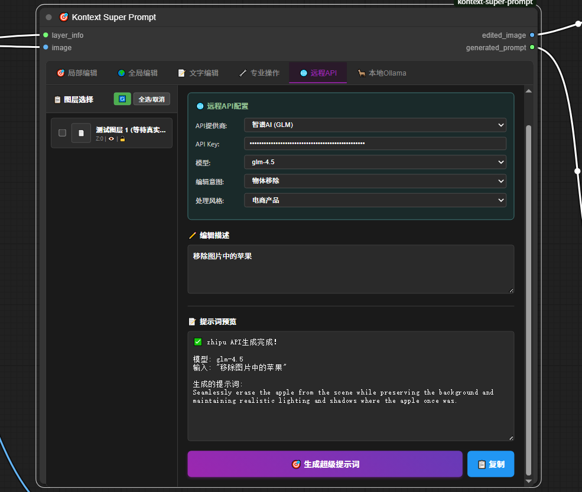
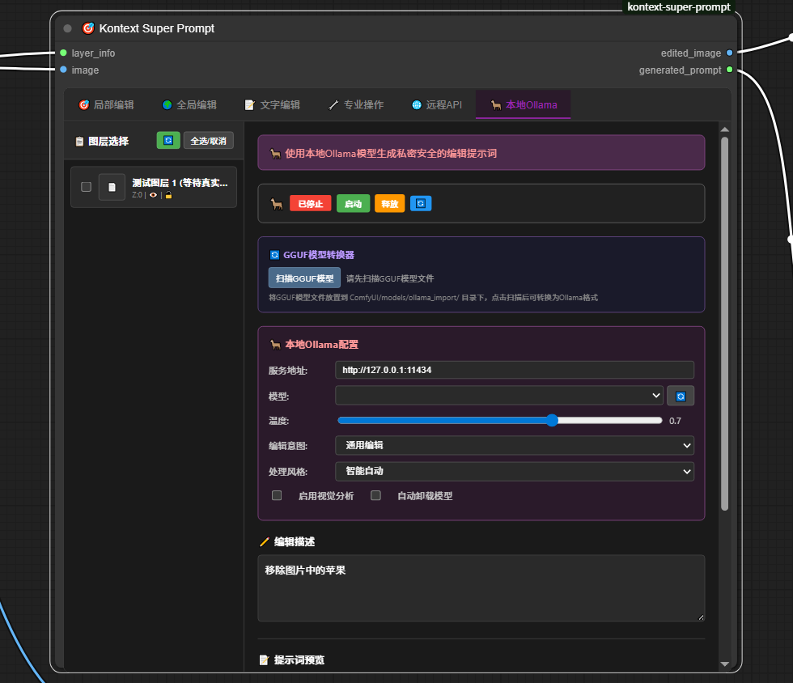
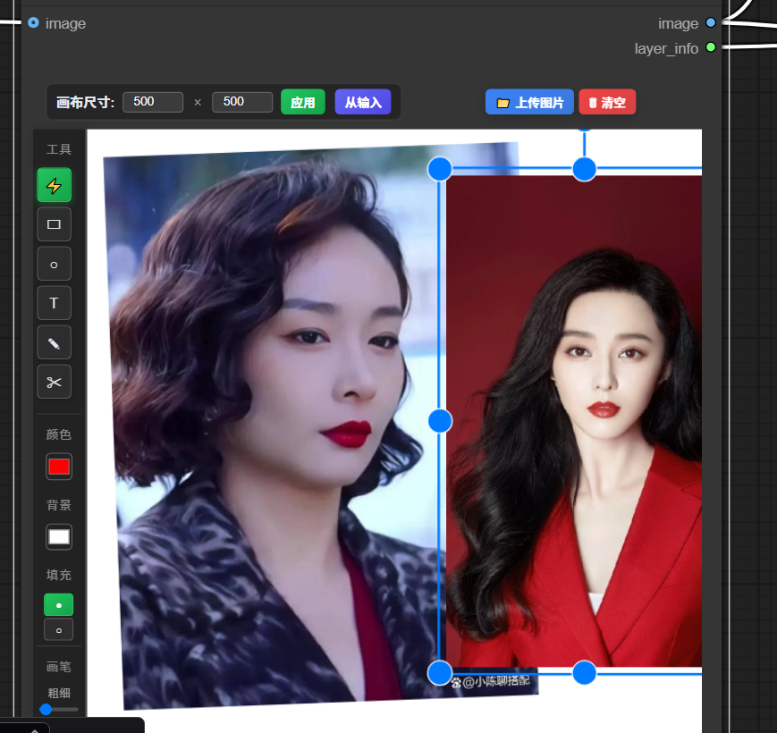
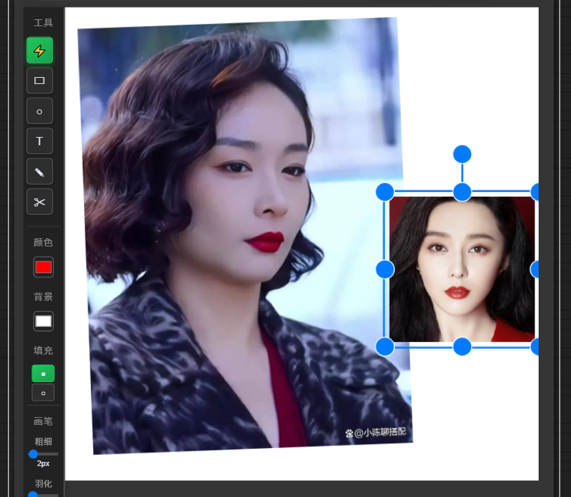
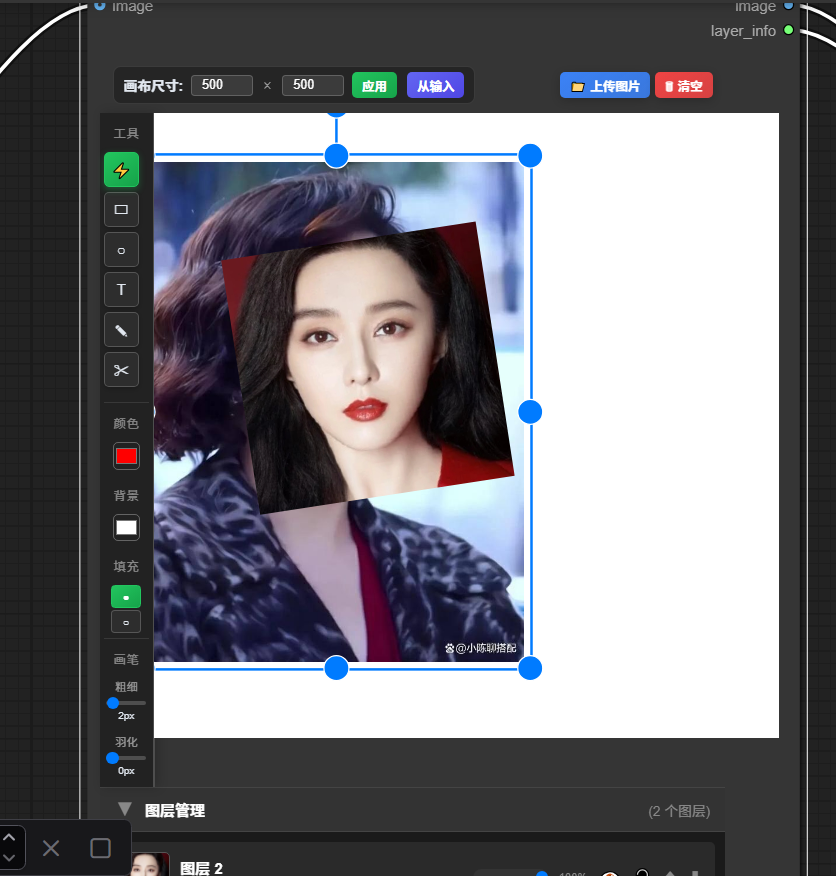

# Kontext Super Prompt

**[中文](#中文) | [English](#english)**

---

<a name="中文"></a>
## 中文

**ComfyUI图像编辑提示词生成节点** - 可视化标注和AI辅助提示词生成


### 🎯 主要功能

#### 🎨 Super Canvas  
可视化画布标注工具，支持图层管理和绘制功能
- 多种绘制工具：画笔、形状、文字、裁切等
- 画笔羽化效果：支持1-20像素可调羽化半径
- 图层管理：添加、删除、调整顺序、修改属性
- 实时预览：画布状态实时同步
- 输出结构化图层数据供下游节点使用


#### Super Prompt
提示词生成器，将图层信息转换为编辑指令
- **六种编辑模式**：
  - 局部编辑：针对特定区域的精确编辑
  - 全局编辑：整体图像风格和效果调整
  - 文字编辑：文本内容的添加和修改
  - 高级操作：高级图像处理功能
  - 远程API：集成云端AI模型
  - 本地Ollama：使用本地大语言模型
- **40+操作模板**：颜色变换、物体移除、背景替换、风格转换等
- **提示词生成**：自动生成约束和修饰提示词
- **英文输出保证**：所有模式强制输出英文提示词


#### 编辑模式界面展示

**局部编辑模式** - 精确的对象级编辑操作


**全局编辑模式** - 整体图像风格和效果调整


**文字编辑模式** - 文本内容的添加和修改


**高级操作模式** - 高级图像处理功能


**远程API模式** - 集成云端AI模型


**本地Ollama模式** - 使用本地大语言模型


#### 🎭 智能面部处理
专为换脸操作设计的高精度面部预处理系统，基于MediaPipe技术
- **双脸对齐算法**：智能识别面部关键点，实现精确的面部对齐，为换脸操作提供最佳匹配
- **眼部优先策略**：以双眼为基准进行旋转和缩放计算，再用鼻子/嘴巴精细调整，确保换脸自然度
- **多特征点识别**：支持眼部、鼻子、嘴巴、耳朵等关键面部特征点检测，提升换脸质量
- **智能坐标映射**：准确处理图像变换和坐标系转换，确保换脸位置精确对齐
- **降级检测机制**：在MediaPipe不可用时提供基于肤色的启发式检测，保证换脸功能稳定性
- **实时预览调整**：支持手动微调和匹配度评分，优化换脸前的面部对齐效果





### 🤖 引导词系统

#### 编辑意图类型（16种操作）
**您想做什么操作：**
- 颜色修改、物体移除、物体替换、物体添加
- 背景更换、换脸、质量增强、图像修复
- 风格转换、文字编辑、光线调整、透视校正
- 模糊/锐化、局部变形、构图调整、通用编辑

#### 应用场景/风格（16种场景）
**用于什么场景：**
- 电商产品、社交媒体、营销活动、人像摄影
- 生活方式、美食摄影、房地产、时尚零售
- 汽车展示、美妆化妆品、企业品牌、活动摄影
- 产品目录、艺术创作、纪实摄影、自动选择

### 📋 使用方法

#### 基础工作流
1. 添加`🎨 Super Canvas`节点，连接图像输入
2. 在画布上标注需要编辑的区域
3. 添加`Super Prompt`节点
4. 选择编辑模式和操作类型
5. 生成编辑指令或使用AI增强功能

#### 节点连接
```
[图像输入] → [Super Canvas] → [Super Prompt] → [输出提示词]
                    ↓                    ↓
                [标注图像]          [图层信息]
```

#### 使用建议

##### 不同场景选择
- **产品图片**：编辑意图选"颜色修改" + 场景选"电商产品"
- **人像美化**：编辑意图选"换脸" + 场景选"人像摄影"
- **营销海报**：编辑意图选"风格转换" + 场景选"营销活动"

##### API使用说明
1. 在对应平台获取API密钥
2. 在远程API选项卡输入密钥
3. 选择模型（系统会自动获取可用模型）
4. 输入编辑描述，点击生成

##### Ollama使用说明
1. 确保已安装Ollama
2. 点击启动服务按钮
3. 选择本地模型
4. 输入描述，生成提示词

### 🛠️ 安装

#### 方法1：通过ComfyUI Manager（推荐）
1. 打开ComfyUI Manager
2. 搜索 "Kontext Super Prompt"
3. 点击安装

#### 方法2：Git克隆
```bash
cd ComfyUI/custom_nodes
git clone https://github.com/aiaiaikkk/super-prompt-canvas.git
```

#### 方法3：手动安装
1. 下载项目ZIP文件
2. 解压到 `ComfyUI/custom_nodes/` 目录
3. 重启ComfyUI

### 📦 依赖要求

- ComfyUI (最新版本)
- Python 3.8+
- PyTorch 1.12+
- Ollama (可选，用于本地模型)

### 🚀 快速开始

1. **安装节点包**：通过上述任一方法安装
2. **重启ComfyUI**：确保节点正确加载
3. **添加节点**：在节点菜单中找到 "kontext_super_prompt" 分类
4. **创建工作流**：按照使用方法连接节点
5. **开始使用**：标注图像，生成提示词

### 🤖 其他节点

#### TextGen WebUI Flux Kontext Enhancer
与Text Generation WebUI的集成，提供提示词增强功能：
- **自动连接**：自动检测TextGen WebUI服务状态
- **双API支持**：兼容OpenAI API和原生API接口
- **引导系统**：内置商业场景引导词模板
- **批量处理**：支持多任务并行处理
- **缓存优化**：缓存机制减少重复请求
- **使用方式**：启动TextGen WebUI后，添加增强器节点即可使用

### 📖 文档

- [安装指南](INSTALLATION.md)
- [示例工作流](examples/)

### 🔗 链接

- [GitHub仓库](https://github.com/aiaiaikkk/super-prompt-canvas)
- [问题反馈](https://github.com/aiaiaikkk/super-prompt-canvas/issues)

---

<a name="english"></a>
## English

**ComfyUI Image Editing Prompt Generation Node** - Visual annotation and AI-assisted prompt generation


### 🎯 Main Features

#### 🎨 Super Canvas
Visual canvas annotation tool with layer management and drawing capabilities
- Multiple drawing tools: brush, shapes, text, crop, etc.
- Brush feathering effect: adjustable feather radius from 1-20 pixels
- Layer management: add, delete, reorder, modify properties
- Real-time preview: canvas state synchronization
- Output structured layer data for downstream nodes


#### Super Prompt
Prompt generator that converts layer information into editing instructions
- **Six editing modes**:
  - Local editing: precise region-specific editing
  - Global editing: overall image style and effect adjustments
  - Text editing: text content addition and modification
  - Advanced operations: advanced image processing features
  - Remote API: integrated cloud AI models
  - Local Ollama: use local large language models
- **40+ operation templates**: color transformation, object removal, background replacement, style transfer, etc.
- **Prompt generation**: automatic generation of constraints and modifier prompts
- **English output guarantee**: all modes force English prompt output


#### Editing Mode Interface Display

**Local Editing Mode** - Precise object-level editing operations


**Global Editing Mode** - Overall image style and effect adjustments


**Text Editing Mode** - Text content addition and modification


**Advanced Operations Mode** - Advanced image processing features


**Remote API Mode** - Integrated cloud AI models


**Local Ollama Mode** - Use local large language models


#### 🎭 Intelligent Face Processing
High-precision face preprocessing system designed for face swapping operations, based on MediaPipe technology
- **Dual face alignment algorithm**: Intelligent identification of facial key points for precise face alignment, providing optimal matching for face swapping
- **Eye-priority strategy**: Rotation and scaling calculations based on eyes, with nose/mouth fine-tuning to ensure natural face swapping
- **Multi-feature point recognition**: Supports detection of key facial features including eyes, nose, mouth, ears, improving face swapping quality
- **Intelligent coordinate mapping**: Accurate handling of image transformation and coordinate system conversion, ensuring precise face swapping alignment
- **Fallback detection mechanism**: Provides skin color-based heuristic detection when MediaPipe is unavailable, ensuring stable face swapping functionality
- **Real-time preview adjustment**: Supports manual fine-tuning and matching score, optimizing face alignment before swapping


### 🤖 Guided Prompt System

#### Editing Intent Types (16 operations)
**What operation do you want to perform:**
- Color modification, Object removal, Object replacement, Object addition
- Background replacement, Face swapping, Quality enhancement, Image restoration
- Style transfer, Text editing, Lighting adjustment, Perspective correction
- Blur/Sharpen, Local deformation, Composition adjustment, General editing

#### Application Scenarios/Styles (16 scenarios)
**What scenario to use for:**
- E-commerce products, Social media, Marketing campaigns, Portrait photography
- Lifestyle, Food photography, Real estate, Fashion retail
- Automotive display, Beauty cosmetics, Corporate branding, Event photography
- Product catalog, Artistic creation, Documentary photography, Auto-select

### 📋 Usage

#### Basic Workflow
1. Add `🎨 Super Canvas` node, connect image input
2. Annotate regions to edit on canvas
3. Add `Super Prompt` node
4. Select editing mode and operation type
5. Generate editing instructions or use AI enhancement features

#### Node Connection
```
[Image Input] → [Super Canvas] → [Super Prompt] → [Output Prompt]
                      ↓                    ↓
                [Annotated Image]     [Layer Info]
```

#### Usage Suggestions

##### Different Scenario Selection
- **Product Images**: Select "Color Modification" for editing intent + "E-commerce Products" for scenario
- **Portrait Enhancement**: Select "Face Swapping" for editing intent + "Portrait Photography" for scenario
- **Marketing Posters**: Select "Style Transfer" for editing intent + "Marketing Campaigns" for scenario

##### API Usage Instructions
1. Obtain API key from corresponding platform
2. Enter key in Remote API tab
3. Select model (system will automatically fetch available models)
4. Input editing description, click generate

##### Ollama Usage Instructions
1. Ensure Ollama is installed
2. Click start service button
3. Select local model
4. Input description, generate prompt

### 🛠️ Installation

#### Method 1: Via ComfyUI Manager (Recommended)
1. Open ComfyUI Manager
2. Search for "Kontext Super Prompt"
3. Click Install

#### Method 2: Git Clone
```bash
cd ComfyUI/custom_nodes
git clone https://github.com/aiaiaikkk/super-prompt-canvas.git
```

#### Method 3: Manual Installation
1. Download project ZIP file
2. Extract to `ComfyUI/custom_nodes/` directory
3. Restart ComfyUI

### 📦 Requirements

- ComfyUI (latest version)
- Python 3.8+
- PyTorch 1.12+
- Ollama (optional, for local models)

### 🚀 Quick Start

1. **Install node package**: Install via any method above
2. **Restart ComfyUI**: Ensure nodes are loaded correctly
3. **Add nodes**: Find "kontext_super_prompt" category in node menu
4. **Create workflow**: Connect nodes according to usage method
5. **Start using**: Annotate images, generate prompts

### 🤖 Other Nodes

#### TextGen WebUI Flux Kontext Enhancer
Integration with Text Generation WebUI, providing prompt enhancement features:
- **Auto-connect**: Automatically detect TextGen WebUI service status
- **Dual API support**: Compatible with OpenAI API and native API interfaces
- **Guidance system**: Built-in commercial scenario prompt templates
- **Batch processing**: Support for parallel multi-task processing
- **Cache optimization**: Caching mechanism to reduce duplicate requests
- **Usage**: After starting TextGen WebUI, add enhancer node to use

### 📖 Documentation

- [Installation Guide](INSTALLATION.md)
- [Example Workflows](examples/)

### 🔗 Links

- [GitHub Repository](https://github.com/aiaiaikkk/super-prompt-canvas)
- [Issue Tracker](https://github.com/aiaiaikkk/super-prompt-canvas/issues)

---

**Version**: 1.4.4
**Author**: aiaiaikkk