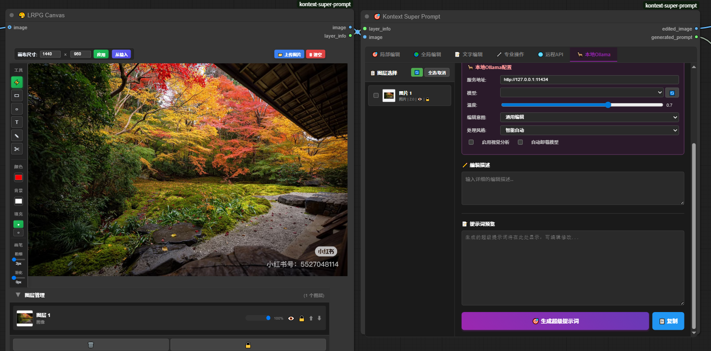
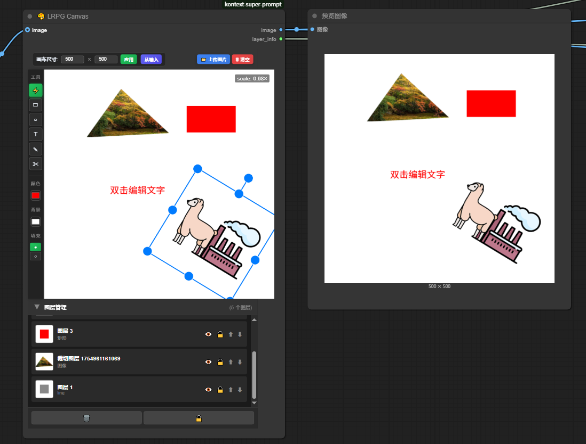
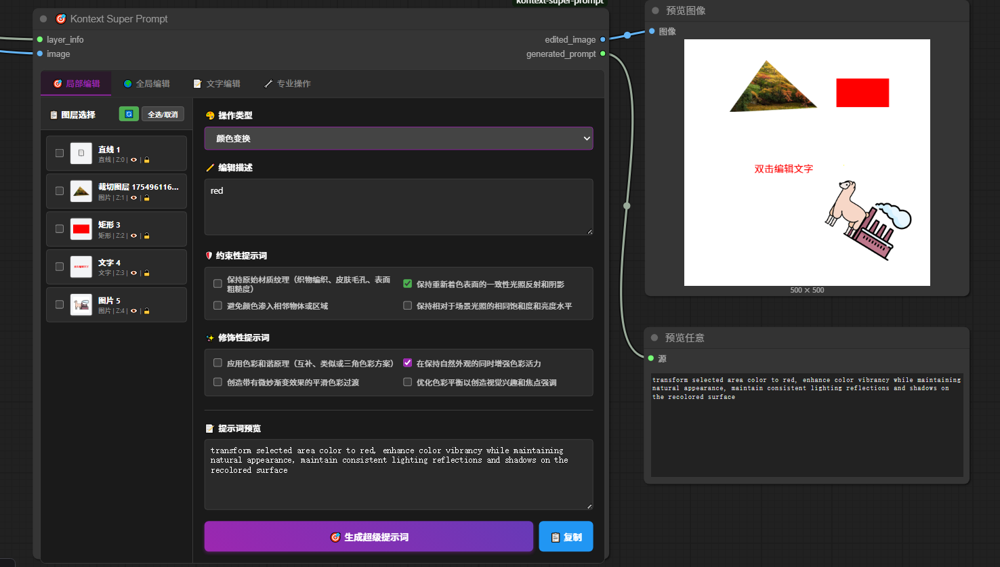
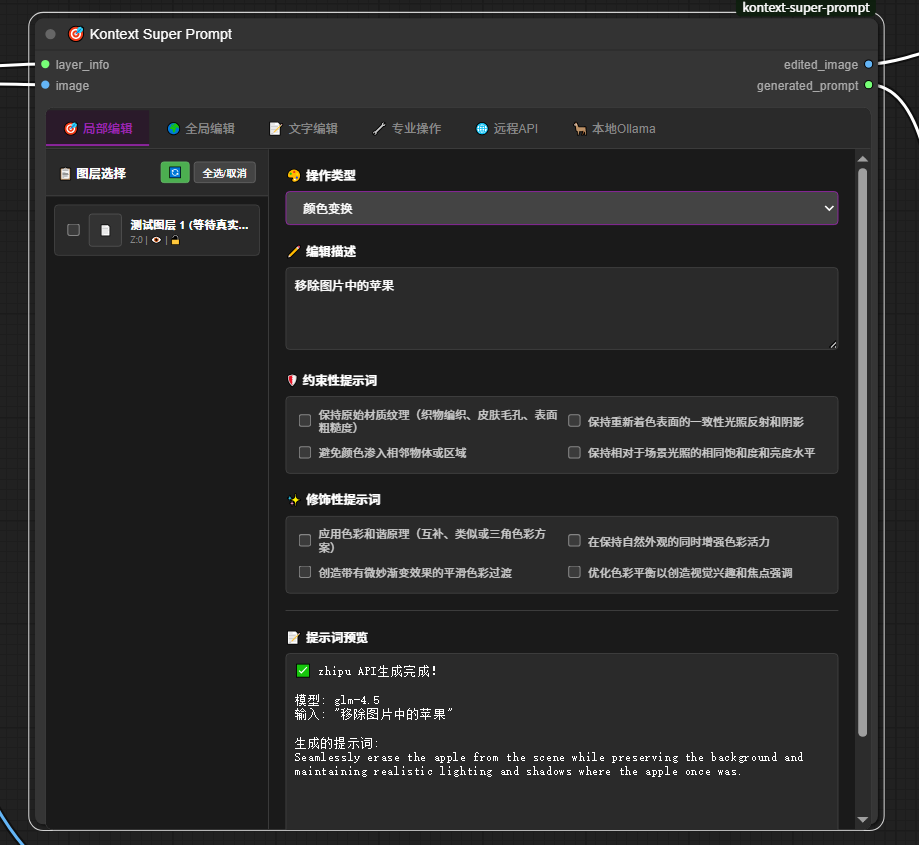
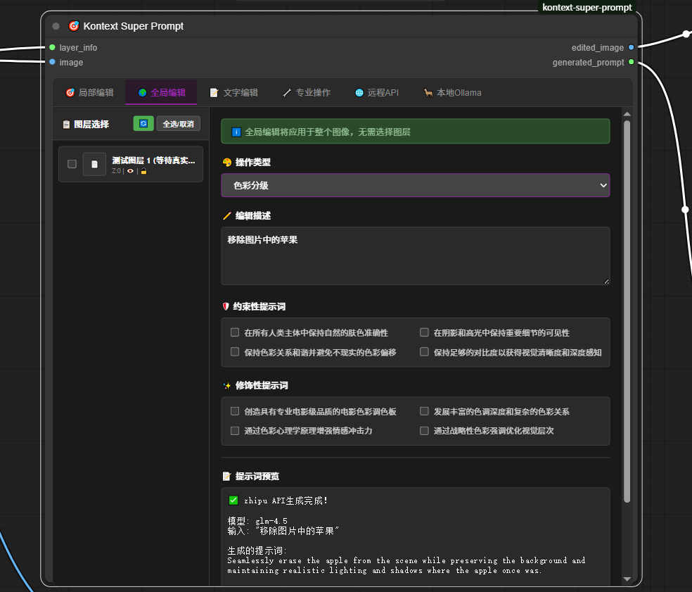
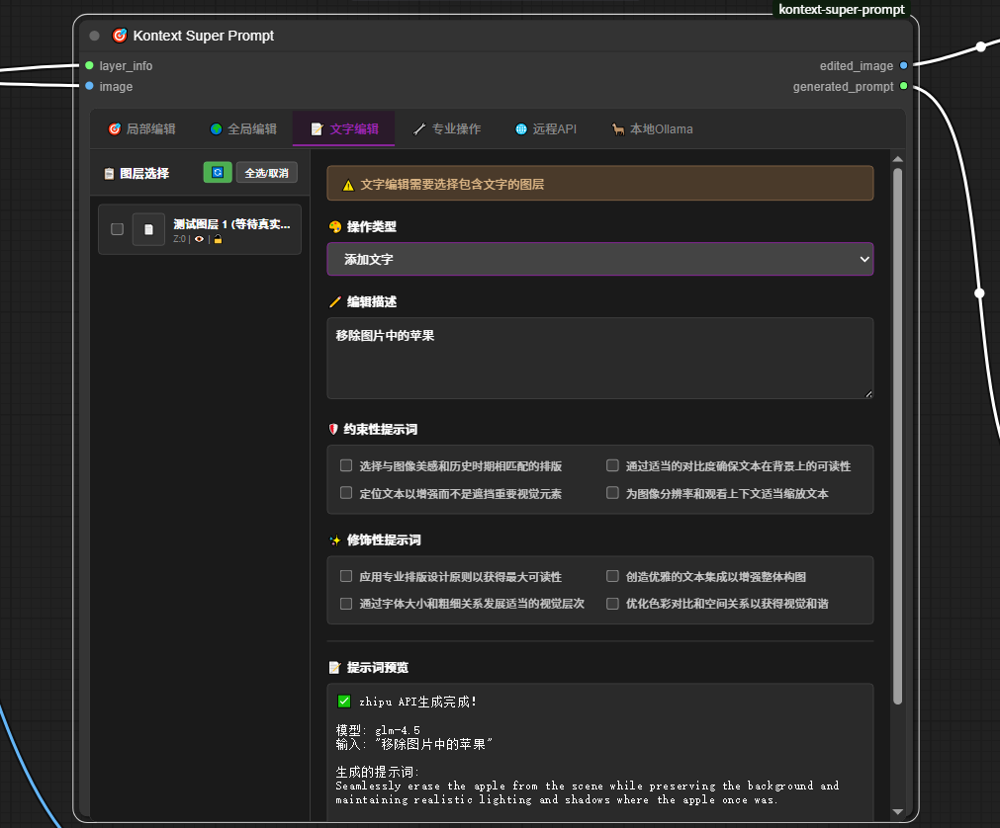
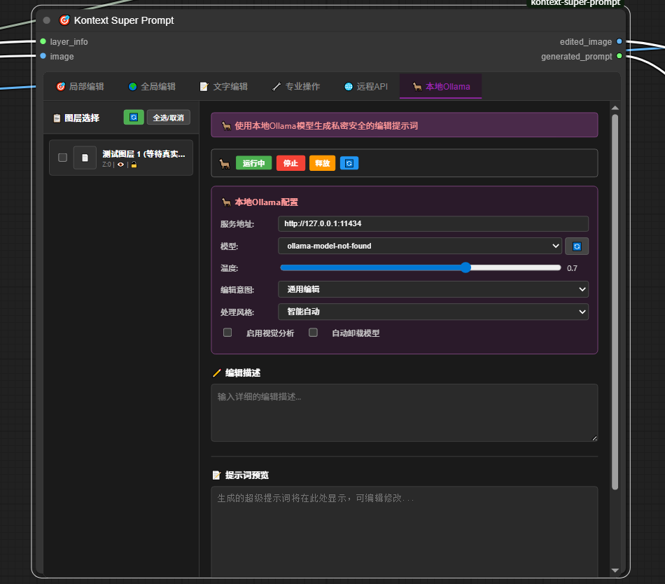
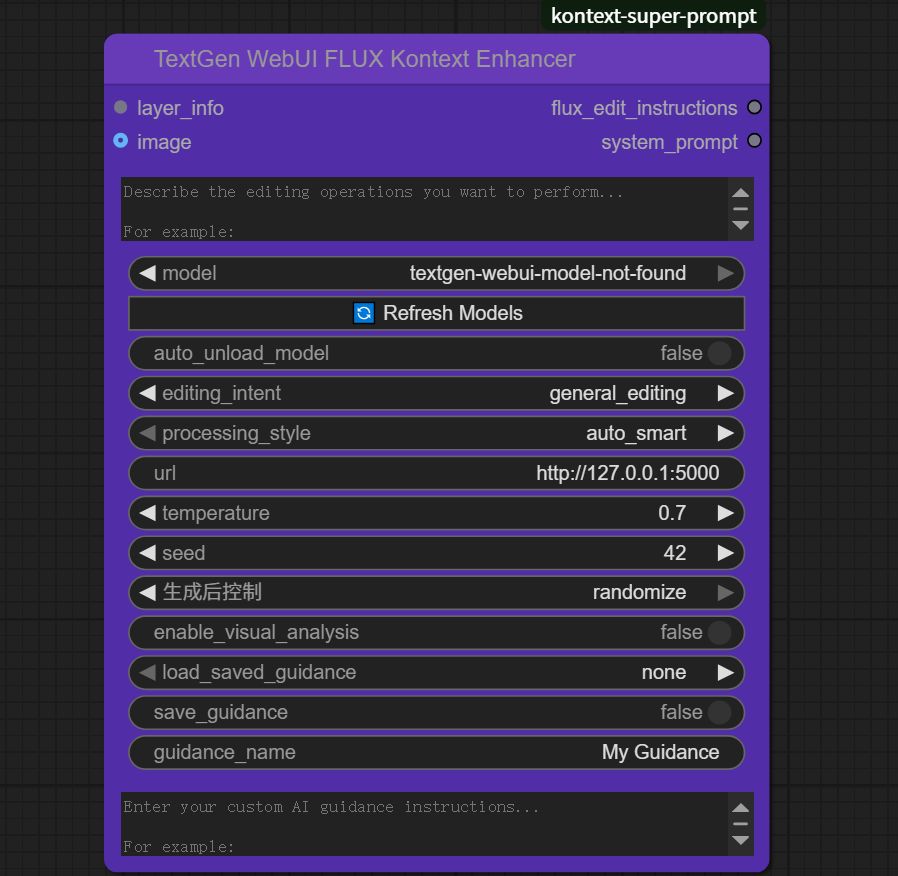

# Kontext Super Prompt

**ComfyUI图像编辑与智能提示词生成工具集** - 专业的可视化编辑与AI增强提示词生成



## 🎯 主要节点

### 🎨 LRPG Canvas  
可视化画布标注工具，提供专业的图层管理和绘制功能
- 基于Fabric.js的交互式画布界面
- 支持多种绘制工具和图层操作（画笔、形状、文字、裁切等）
- **画笔羽化效果**: 高斯分布算法实现的专业边缘羽化，8-15层透明度渐变
- **精确鼠标控制**: 完全修复的画笔工具，按住绘制、释放停止，响应自然
- 自动生成结构化图层数据供下游节点使用
- 实时画布状态同步



### 🎯 Kontext Super Prompt
智能提示词生成器，将图层信息转换为结构化编辑指令
- **五种编辑模式**: 局部编辑、全局编辑、文字编辑、专业操作、远程API、本地Ollama
- **40+操作模板**: 涵盖颜色变换、风格重构、智能替换等
- **约束和修饰**: 自动生成质量控制和效果增强提示词
- **AI增强集成**: 内置远程API和本地Ollama服务支持
- **确定性输出**: 相同输入保证相同结果



#### 🆕 最新功能亮点

- **🌐 内置远程API**: 无需额外节点，直接在编辑界面使用OpenAI、Gemini、DeepSeek等云端AI
- **🦙 集成Ollama服务**: 内置服务管理，支持一键启动/停止，自动释放GPU内存
- **🔄 动态模型获取**: 自动获取最新AI模型列表，支持Gemini 2.0、GPT-4o等最新模型
- **💬 聊天式交互**: API和Ollama选项卡支持自由输入，类似ChatGPT的交互体验
- **⚡ 智能资源管理**: 自动检测服务状态，一键释放GPU显存，优化系统资源
- **🎨 修复画笔工具**: 完全修复LRPG Canvas画笔的鼠标响应问题，确保按住绘制、释放停止的正常交互
- **✨ 改进羽化效果**: 使用高斯分布算法实现真正的边缘羽化，多层透明度渐变，媲美专业图像编辑软件

#### 编辑模式界面展示

**局部编辑模式** - 精确的对象级编辑操作


**全局编辑模式** - 整体图像风格和效果调整


**远程API模式** - 集成多种云端AI模型，支持动态模型选择


**本地Ollama模式** - 内置服务管理，一键启动/停止，释放GPU资源


## 💬 集成AI功能

项目已将AI功能完全集成到前端界面中，提供更流畅的用户体验：

### 🌐 内置远程API支持
- **多平台集成**: 直接在编辑界面使用OpenAI、Gemini、DeepSeek等云端AI
- **动态模型选择**: 自动获取最新AI模型列表，支持Gemini 2.0、GPT-4o等最新模型  
- **成本控制**: 实时显示Token消耗和费用估算
- **聊天式交互**: 类似ChatGPT的自由输入体验

### 🦙 内置Ollama服务
- **服务管理**: 一键启动/停止，智能释放GPU资源
- **隐私保护**: 完全本地处理，无需网络连接
- **模型管理**: 支持多种开源LLM模型
- **参数可调**: 温度、最大Token等参数自定义

## 🤖 外部AI集成

### TextGenWebUI Flux Kontext Enhancer
与Text Generation WebUI的集成方案
- **无缝对接**: 直接调用WebUI接口
- **批量处理**: 支持多任务并行处理
- **状态监控**: 实时显示处理进度



## 📋 使用方法

### 基础工作流
1. 添加`🎨 LRPG Canvas`节点，连接图像输入
2. 在画布中创建图层和标注区域
3. 连接`🎯 Kontext Super Prompt`节点生成编辑指令
4. 在Kontext Super Prompt界面中使用内置的API或Ollama功能优化提示词

### 节点连接
- **LRPG Canvas**: 输出`image`和`layer_info`
- **Kontext Super Prompt**: 接收`layer_info`和`image`，输出`edited_image`和`generated_prompt`
- **内置AI功能**: 直接在Kontext Super Prompt界面中使用，无需额外节点

## 🛠️ 安装

### 方式一：Git克隆安装
```bash
cd ComfyUI/custom_nodes
git clone https://github.com/aiaiaikkk/kontext-super-prompt.git
pip install torch torchvision opencv-python openai
```

### 方式二：ComfyUI Manager安装
1. 打开ComfyUI Manager
2. 搜索"kontext-super-prompt"
3. 点击安装并重启ComfyUI

### 安装完成
重启ComfyUI后，在节点菜单中找到"🎨 LRPG Canvas"分类

## ⚡ 核心特性

- **专业画布**: 基于Fabric.js的高性能图层编辑器
- **智能模板**: 40+种专业编辑操作模板  
- **多AI集成**: 内置远程API和本地Ollama服务支持
- **动态模型选择**: 自动获取最新可用AI模型列表
- **服务管理**: 一键启动/停止Ollama服务，智能释放GPU资源
- **模块化设计**: 节点可独立使用或组合使用
- **实时同步**: 画布状态与节点数据实时同步

---

**版本**: 1.3.3 | **许可**: MIT | **仓库**: https://github.com/aiaiaikkk/kontext-super-prompt

## 🔧 最新更新日志 (v1.3.3)

### 🎨 LRPG Canvas 重大改进
- **✅ 修复画笔工具**: 完全解决了画笔鼠标事件处理问题
  - 修复了"鼠标在画布上就绘制"的异常行为
  - 确保只有按住鼠标左键时才绘制，释放时停止
  - 动态管理事件监听器，避免与Fabric.js内置功能冲突
- **🎯 真正的羽化效果**: 重构羽化算法实现专业级边缘效果
  - 使用高斯分布数学模型计算透明度衰减
  - 8-15层透明度渐变，提供平滑自然的边缘模糊
  - 替换简单阴影效果，实现真正的边缘羽化
  - 支持1-20像素可调羽化半径

### 🗑️ 架构简化
- **移除独立Enhancer节点**: 废弃API、Ollama等独立enhancer节点
- **前端集成优化**: 主要AI功能已集成到Kontext Super Prompt前端界面
- **保留外部集成**: 保留TextGen WebUI enhancer节点，支持外部AI系统对接
- **减少复杂度**: 核心AI功能无需多个节点连接，在单一界面内完成

---

# Kontext Super Prompt

**ComfyUI Image Editing & Intelligent Prompt Generation Toolkit** - Professional visual editing with AI-enhanced prompt generation


## 🎯 Main Nodes

### 🎨 LRPG Canvas  
Visual canvas annotation tool providing professional layer management and drawing capabilities
- Interactive canvas interface based on Fabric.js
- Support for multiple drawing tools and layer operations (brush, shapes, text, cropping, etc.)
- **Brush Feather Effect**: Professional edge feathering with Gaussian distribution algorithm, 8-15 layer transparency gradients
- **Precise Mouse Control**: Completely fixed brush tool with natural hold-to-draw, release-to-stop response
- Automatically generates structured layer data for downstream nodes
- Real-time canvas state synchronization


### 🎯 Kontext Super Prompt
Intelligent prompt generator that converts layer information into structured editing instructions
- **Five editing modes**: Local editing, global editing, text editing, professional operations, remote API, local Ollama
- **40+ operation templates**: Including color transformation, style reconstruction, intelligent replacement, etc.
- **Constraints and enhancements**: Automatically generates quality control and effect enhancement prompts
- **AI Enhancement Integration**: Built-in remote API and local Ollama service support
- **Deterministic output**: Same input guarantees same results


#### 🆕 Latest Feature Highlights

- **🌐 Built-in Remote API**: No additional nodes needed, directly use OpenAI, Gemini, DeepSeek and other cloud AI in the editing interface
- **🦙 Integrated Ollama Service**: Built-in service management with one-click start/stop and automatic GPU memory release
- **🔄 Dynamic Model Fetching**: Automatically fetch latest AI model lists, supporting Gemini 2.0, GPT-4o and other newest models
- **💬 Chat-like Interaction**: API and Ollama tabs support free input with ChatGPT-like interactive experience
- **⚡ Smart Resource Management**: Automatic service status detection, one-click GPU memory release, optimized system resources
- **🎨 Fixed Brush Tool**: Completely fixed LRPG Canvas brush mouse response issues, ensuring proper hold-to-draw, release-to-stop interaction
- **✨ Enhanced Feather Effect**: Gaussian distribution algorithm for true edge feathering with multi-layer transparency gradients, comparable to professional image editing software

#### Editing Mode Interface Showcase

**Local Editing Mode** - Precise object-level editing operations


**Remote API Mode** - Integrated multiple cloud AI models with dynamic model selection


**Local Ollama Mode** - Built-in service management with one-click start/stop and GPU resource management


**Professional Operations Mode** - Advanced image processing and professional editing features


## 💬 Integrated AI Features

The project has fully integrated AI functionality into the frontend interface for a smoother user experience:

### 🌐 Built-in Remote API Support
- **Multi-platform Integration**: Directly use OpenAI, Gemini, DeepSeek and other cloud AI in the editing interface
- **Dynamic Model Selection**: Automatically fetch latest AI model lists, supporting Gemini 2.0, GPT-4o and other newest models
- **Cost Control**: Real-time display of token consumption and cost estimation
- **Chat-like Interaction**: ChatGPT-like free input experience

### 🦙 Built-in Ollama Service
- **Service Management**: One-click start/stop with intelligent GPU resource management
- **Privacy Protection**: Completely local processing, no network connection required
- **Model Management**: Support for various open-source LLM models
- **Adjustable Parameters**: Customizable temperature, max tokens, and other parameters

## 🤖 External AI Integration

### TextGenWebUI Flux Kontext Enhancer
Integration solution with Text Generation WebUI
- **Seamless Integration**: Direct WebUI interface calls
- **Batch Processing**: Support for multi-task parallel processing
- **Status Monitoring**: Real-time display of processing progress


## 📋 Usage

### Basic Workflow
1. Add `🎨 LRPG Canvas` node and connect image input
2. Create layers and annotation areas in the canvas
3. Connect `🎯 Kontext Super Prompt` node to generate editing instructions
4. Use built-in API or Ollama features directly in the Kontext Super Prompt interface to optimize prompts

### Node Connections
- **LRPG Canvas**: Outputs `image` and `layer_info`
- **Kontext Super Prompt**: Receives `layer_info` and `image`, outputs `edited_image` and `generated_prompt`
- **Built-in AI Features**: Used directly within the Kontext Super Prompt interface, no additional nodes required

## 🛠️ Installation

### Method 1: Git Clone Installation
```bash
cd ComfyUI/custom_nodes
git clone https://github.com/aiaiaikkk/kontext-super-prompt.git
pip install torch torchvision opencv-python openai
```

### Method 2: ComfyUI Manager Installation
1. Open ComfyUI Manager
2. Search for "kontext-super-prompt"
3. Click install and restart ComfyUI

### Installation Complete
After restarting ComfyUI, find the "🎨 LRPG Canvas" category in the node menu

## ⚡ Core Features

- **Professional Canvas**: High-performance layer editor based on Fabric.js
- **Intelligent Templates**: 40+ professional editing operation templates
- **Multi-AI Integration**: Built-in remote API and local Ollama service support
- **Dynamic Model Selection**: Automatically fetches latest available AI model lists
- **Service Management**: One-click Ollama service start/stop with intelligent GPU resource management
- **Modular Design**: Nodes can be used independently or in combination
- **Real-time Sync**: Canvas state synchronizes with node data in real-time

---

**Version**: 1.3.3 | **License**: MIT | **Repository**: https://github.com/aiaiaikkk/kontext-super-prompt

## 🔧 Latest Update Log (v1.3.3)

### 🎨 LRPG Canvas Major Improvements
- **✅ Fixed Brush Tool**: Completely resolved brush mouse event handling issues
  - Fixed abnormal "drawing when mouse is on canvas" behavior
  - Ensures drawing only occurs when holding left mouse button, stops when released
  - Dynamic event listener management to avoid conflicts with Fabric.js built-in functionality
- **🎯 True Feather Effect**: Reconstructed feathering algorithm for professional-grade edge effects
  - Uses Gaussian distribution mathematical model for transparency decay calculation
  - 8-15 layer transparency gradients providing smooth and natural edge blur
  - Replaced simple shadow effects with true edge feathering
  - Supports adjustable feather radius from 1-20 pixels

### 🗑️ Architecture Simplification
- **Removed Standalone Enhancer Nodes**: Deprecated API, Ollama and other standalone enhancer nodes
- **Frontend Integration Optimization**: Core AI functionality integrated into Kontext Super Prompt frontend interface
- **Preserved External Integration**: Kept TextGen WebUI enhancer node for external AI system integration
- **Reduced Complexity**: Core AI features no longer need multiple node connections, completed within a single interface