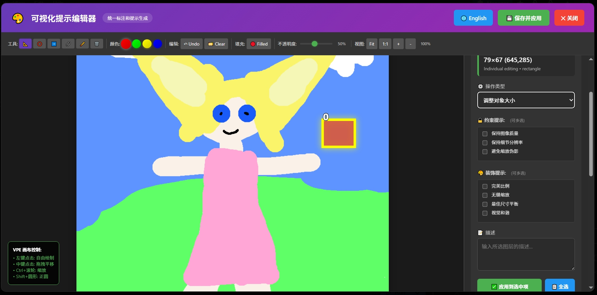
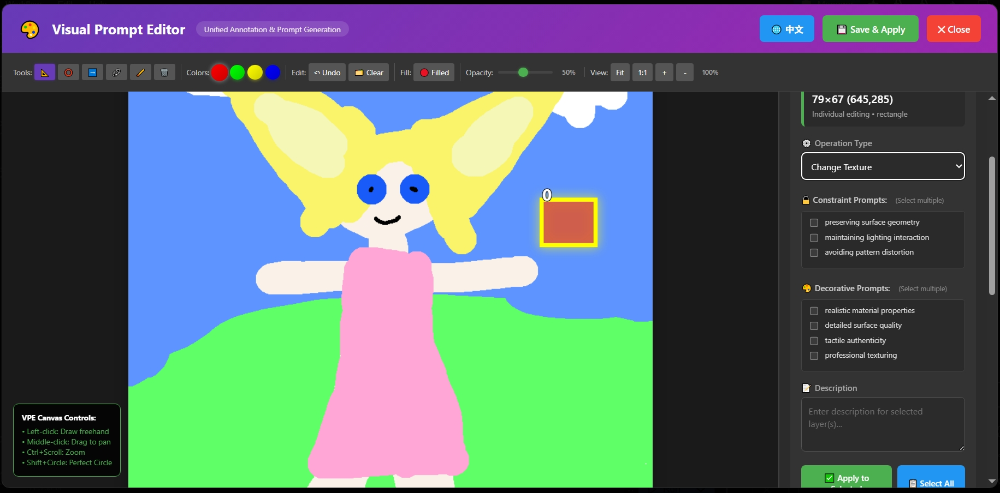

# Kontext Visual Prompt Editor - 智能可视化提示编辑器

**[🇨🇳 中文说明](#chinese-docs) | [🇺🇸 English Manual](#english-docs)**

---

## 🇨🇳 中文说明

### 📖 产品介绍

Kontext Visual Prompt Editor 是一款图像编辑辅助工具，帮助用户轻松创建AI图像编辑指令。您只需在图片上标记想要修改的区域，描述您的想法，工具会自动生成专业的编辑指令，无需学习复杂的提示词语法。

### ✨ 主要功能

#### 🖼️ 图像标注
- 提供矩形、圆形、箭头和自由绘制四种标注工具
- 支持红、绿、黄、蓝四种颜色标记
- 可同时标记多个区域进行批量编辑
- 支持调节标注的大小、透明度等属性

#### 📝 编辑指令生成
- **局部编辑**：修改特定对象的颜色、样式、纹理等属性
- **全局调整**：调整整张图片的色调、光线、风格效果
- **文本操作**：在图片上添加、删除或修改文字内容
- **专业处理**：进行图像合成、变形等高级编辑操作

#### 🤖 AI智能辅助
- **本地AI支持**：使用本地AI模型，保护数据隐私
- **云端AI服务**：连接多种在线AI服务，获得更强的处理能力
- **智能理解**：自动分析您的编辑需求，提供合适的编辑建议
- **模板系统**：提供多种预设编辑模板，覆盖常见的编辑场景

#### 🌐 多语言界面
- 支持中文和英文界面切换
- 一键切换语言，所有界面文本自动更新
- 界面语言设置自动保存

### 🎯 使用场景

#### 人像修图
- 调整人物的表情、服装、发型
- 修改肤色、去除瑕疵
- 改变人物姿势或添加配饰

#### 场景美化
- 更换背景环境
- 调整天空颜色或天气效果
- 修改场景中的物体颜色或样式

#### 产品图片
- 调整产品颜色和材质
- 优化光照和阴影效果
- 添加或移除产品元素

#### 创意设计
- 将照片转换为不同的艺术风格
- 添加创意元素和特效
- 制作拼图和合成图片

### ✨ 效果演示

以下示例展示了节点如何结合**编辑意图 (做什么)** 和 **处理风格 (怎么做)** 来生成最终的AI指令。

---

**示例1: 电商产品展示 - 专业风格**

*   **目标**: 将一张普通运动鞋照片变为专业的电商广告图。
*   **设置**:
    *   **编辑意图**: `产品展示 (product_showcase)`
    *   **处理风格**: `精确技术 (precise_technical)`
*   **AI指令解读**:
    *   **处理风格** (`precise_technical`) -> AI被指令扮演**“高级数字成像专家”**，要求生成技术性、专业级的指令。
    *   **编辑意图** (`product_showcase`) -> 为上述指令填充细节，如"专业产品照明"、"突出产品质感"、"目录级色彩标准"。
*   **预期效果**: AI将生成一张具有专业影棚光效、背景简洁、鞋子细节和材质表现突出的高质量产品图，严格遵循技术参数。

---

**示例2: 人像照片增强 - 艺术风格**

*   **目标**: 将一张普通人像照片处理成具有艺术感的时尚大片。
*   **设置**:
    *   **编辑意图**: `人像增强 (portrait_enhancement)`
    *   **处理风格**: `创意艺术 (creative_artistic)`
*   **AI指令解读**:
    *   **处理风格** (`creative_artistic`) -> AI被指令扮演**“富有远见的艺术总监”**，鼓励进行富有想象力的创造。
    *   **编辑意图** (`portrait_enhancement`) -> 为创作提供基础，指示AI优化"自然肤色"、"柔和人像光"和"人物为焦点"。
*   **预期效果**: 在优化人像的基础上，AI会增添独特的艺术氛围，可能包括戏剧性的光影、概念化的背景或特殊的色调，最终生成一张充满创意的人像艺术照。

---

**示例3: 风景照片重塑 - 智能风格**

*   **目标**: 将一张白天拍摄的普通风景照变为梦幻的黄昏景象。
*   **设置**:
    *   **编辑意图**: `风景自然 (landscape_nature)`
    *   **处理风格**: `智能自动 (auto_smart)`
    *   **描述**: "将天空变为黄昏时的橘红色，并给景物染上温暖的日落光辉。"
*   **AI指令解读**:
    *   **处理风格** (`auto_smart`) -> AI被指令扮演**“图像分析专家”**，根据用户描述选择最有效的策略。
    *   **编辑意图** (`landscape_nature`) -> 为AI提供场景约束，强调"自然光线"和"环境和谐"。
*   **预期效果**: AI将智能地重绘天空，调整全局光照，使整张照片呈现出和谐、自然的黄昏美景，所有元素的色彩和光影都会被统一到日落的氛围中。

---

### 🚀 操作步骤

#### 基本使用
1. **打开编辑器**：双击节点打开编辑界面
2. **选择工具**：从工具栏选择合适的标注工具
3. **标记区域**：在图片上圈出需要编辑的部分
4. **选择操作**：从模板中选择想要进行的编辑类型
5. **描述需求**：用简单的语言描述您的编辑想法
6. **生成指令**：点击生成按钮，获得专业的编辑指令

#### 高级操作
- **多区域编辑**：用不同颜色标记多个区域，一次处理多个编辑任务
- **精细调整**：通过约束条件和装饰选项优化编辑效果
- **自定义模板**：保存常用的编辑设置，提高工作效率
- **语言切换**：点击界面右上角的语言按钮切换中英文

### 💡 产品特色

#### 简单易用
- 直观的图形操作界面，无需专业技能
- 丰富的编辑模板，适合各种编辑需求
- 自动生成专业指令，节省学习时间

#### 功能全面
- 涵盖图像编辑的各个方面
- 支持从简单修改到复杂合成的各种操作
- 提供多种AI后端选择，适应不同使用环境

#### 灵活扩展
- 支持自定义编辑模板
- 可与其他ComfyUI工具配合使用
- 定期更新功能，持续改进用户体验

### 核心功能详解

本编辑器提供了四大类编辑意图，每个意图下包含多种处理风格，以满足不同的编辑需求。

#### 1. 局部编辑 (Local Editing)
针对图像中的特定选区进行精细化修改。

- **改变颜色 (Change Color)**: 修改选中对象的颜色。
- **改变风格 (Change Style)**: 将选中对象转换为不同的艺术风格。
- **替换对象 (Replace Object)**: 将选中对象替换为其他物体。
- **添加对象 (Add Object)**: 在选区内添加新的物体。
- **移除对象 (Remove Object)**: 从图像中移除选定的对象。
- **改变纹理 (Change Texture)**: 修改选中对象的表面纹理。
- **改变姿势 (Change Pose)**: 调整人物或动物的姿势。
- **改变表情 (Change Expression)**: 修改人物的面部表情。
- **改变服装 (Change Clothing)**: 更换人物的衣物。
- **改变背景 (Change Background)**: 替换选区后的背景。
- **提升质量 (Enhance Quality)**: 增强选区的图像质量和细节。
- **模糊背景 (Blur Background)**: 对选区后的背景进行模糊处理。
- **调整光照 (Adjust Lighting)**: 修改选区的光照效果。
- **调整对象大小 (Resize Object)**: 改变选中对象的大小。
- **增强皮肤纹理 (Enhance Skin Texture)**: 优化人物的皮肤细节。
- **角色表情 (Character Expression)**: 专门用于调整角色的表情。
- **角色发型 (Character Hair)**: 专门用于修改角色的发型。
- **角色配饰 (Character Accessories)**: 为角色添加或修改配饰。
- **聚焦缩放 (Zoom Focus)**: 对选区进行特写或缩放。
- **局部风格化 (Stylize Local)**: 对选区应用特定的艺术风格。
- **自定义操作 (Custom Operation)**: 用户可以输入完全自定义的编辑指令。

#### 2. 全局调整 (Global Adjustments)
对整个图像应用统一的调整。

- **色彩分级 (Color Grading)**: 对整个图像进行电影级的专业调色。
- **风格迁移 (Style Transfer)**: 将整个图像转换为不同的艺术风格（如复古、卡通等）。
- **亮度与对比度 (Brightness & Contrast)**: 调整全局亮度和对比度。
- **色相与饱和度 (Hue & Saturation)**: 调整全局色相和饱和度。
- **锐化/模糊 (Sharpen/Blur)**: 对整个图像进行锐化或模糊处理。
- **降噪 (Noise Reduction)**: 减少图像中的噪点。
- **全局增强 (Global Enhance)**: 全面提升图像的整体质量。
- **滤镜效果 (Filter Effect)**: 为图像应用预设的滤镜效果（如棕褐色、黑白等）。
- **角色年龄 (Character Age)**: 调整图像中人物的年龄。
- **细节增强 (Detail Enhance)**: 增强整个图像的细节。
- **真实感增强 (Realism Enhance)**: 提升图像的真实感。
- **镜头操作 (Camera Operation)**: 模拟镜头操作，如推远或拉近。
- **场景重打光 (Relight Scene)**: 为整个场景重新进行专业打光。
- **图像上色 (Colorize Image)**: 为黑白图像上色。
- **场景传送 (Teleport Context)**: 将图像中的主体传送到一个全新的场景中。

#### 3. 文本编辑 (Text Editing)
在图像上进行文字相关的操作。

- **添加文字 (Add Text)**: 在图像中添加指定的文字内容。
- **移除文字 (Remove Text)**: 智能移除图像中的文字。
- **编辑文字 (Edit Text)**: 修改图像中已有的文字内容。
- **缩放文字 (Resize Text)**: 调整图像中文字的大小。
- **对象组合 (Object Combine)**: 将文字作为对象与其他图像元素进行组合。

#### 4. 专业操作 (Professional Operations)
提供更高级、更复杂的专业级编辑功能。

- **几何扭曲 (Geometric Warp)**: 对图像或选区进行非线性的几何形状调整。
- **透视变换 (Perspective Transform)**: 校正或改变图像的透视角度。
- **镜头畸变 (Lens Distortion)**: 模拟或校正不同类型的镜头畸变效果。
- **全局透视 (Global Perspective)**: 对整个图像进行透视校正。
- **内容感知填充 (Content-Aware Fill)**: 智能填充移除对象后留下的空白区域。
- **无缝移除 (Seamless Removal)**: 比标准移除更高级，效果更自然。
- **智能修补 (Smart Patch)**: 使用周围的图像信息智能修复选区。
- **风格混合 (Style Blending)**: 将两种或多种风格在图像中进行融合。
- **拼贴集成 (Collage Integration)**: 将多个图像元素融合成一个和谐的拼贴作品。
- **纹理混合 (Texture Mixing)**: 将不同的纹理材质进行混合。
- **精确抠图 (Precision Cutout)**: 提供像素级的精确对象抠图。
- **Alpha合成 (Alpha Composite)**: 基于透明通道将多个图层进行合成。
- **蒙版羽化 (Mask Feathering)**: 柔化选区的边缘，使其与背景更自然地融合。
- **深度合成 (Depth Composite)**: 基于深度信息将图像进行合成，创造更真实的空间感。
- **专业产品 (Professional Product)**: 专为产品图设计，可生成商业级质量的图像。

### AI增强节点详解 (AI Enhanced Node Explained)
AI增强节点上的下拉控件可以帮助您指导AI更好地理解您的创作目标。选择合适的意图和风格，将极大提升最终效果的准确性和质量。

#### 1. 编辑意图 (Editing Intent)
- **产品展示 (product_showcase)**: 优化产品光照、材质和背景，适用于电商展示。
- **人像增强 (portrait_enhancement)**: 优化人像的皮肤、发型和光影，提升生动感。
- **创意设计 (creative_design)**: 适用于艺术创作，鼓励AI生成富有想象力的结果。
- **建筑摄影 (architectural_photo)**: 强化建筑线条、结构和空间感，适用于建筑与室内设计。
- **美食造型 (food_styling)**: 优化食物色泽、质感与摆盘，提升视觉吸引力。
- **时尚零售 (fashion_retail)**: 突出服装与配饰的材质、剪裁和设计感。
- **风景自然 (landscape_nature)**: 优化自然风光的色彩、光线和氛围。
- **专业编辑 (professional_editing)**: 提供更精确的技术控制，适合专业摄影师与设计师。
- **通用编辑 (general_editing)**: 适用于日常编辑，快速获得高质量结果。
- **自定义 (custom)**: 不使用预设，完全由用户自定义编辑方向。

#### 2. 处理风格 (Processing Style)
- **智能自动 (auto_smart)**: AI根据内容和意图自动选择最优处理策略。
- **高效快速 (efficient_fast)**: 优先保证处理速度，适用于快速迭代。
- **创意艺术 (creative_artistic)**: AI采用更大胆、更具艺术性的处理方法。
- **精确技术 (precise_technical)**: AI严格遵循技术指令，进行高精度编辑。
- **自定义指引 (custom_guidance)**: 在“自定义指引”输入框中提供详细指令，完全控制AI。

### 🔧 安装方法

#### Git安装
1. 打开终端或命令行界面
2. 进入ComfyUI的`custom_nodes`目录
3. 运行 `git clone https://github.com/aiaiaikkk/kontext-super-prompt` 命令
4. 重启ComfyUI

#### 手动安装
1. 下载插件文件包
2. 将文件夹放置到ComfyUI的custom_nodes目录下
3. 重启ComfyUI程序
4. 在工作流中添加相应节点

### 📋 系统要求

- ComfyUI版本：需要较新版本支持
- 浏览器：Chrome、Firefox、Safari或Edge浏览器
- 内存：建议4GB以上可用内存
- 网络：部分AI功能需要网络连接

---

## 🇺🇸 English Manual

### 📖 Product Introduction

Kontext Visual Prompt Editor is an image editing assistant tool that helps users easily create AI image editing instructions. Simply mark the areas you want to modify on the image, describe your ideas, and the tool will automatically generate professional editing instructions without needing to learn complex prompt syntax.

### ✨ Main Features

#### 🖼️ Image Annotation
- Provides four annotation tools: rectangle, circle, arrow, and freehand drawing
- Supports four color markers: red, green, yellow, and blue
- Allows simultaneous marking of multiple areas for batch editing
- Supports adjustment of annotation size, transparency, and other properties

#### 📝 Editing Instruction Generation
- **Local Editing**: Modify specific object colors, styles, textures, and other attributes
- **Global Adjustment**: Adjust overall image tone, lighting, and style effects
- **Text Operations**: Add, delete, or modify text content on images
- **Professional Processing**: Perform advanced editing operations like image compositing and transformation

#### 🤖 AI Intelligent Assistance
- **Local AI Support**: Uses local AI models to protect data privacy
- **Cloud AI Services**: Connects to various online AI services for enhanced processing power
- **Smart Understanding**: Automatically analyzes your editing needs and provides suitable editing suggestions
- **Template System**: Provides various preset editing templates covering common editing scenarios

#### 🌐 Multi-language Interface
- Supports Chinese and English interface switching
- One-click language switching with automatic text updates
- Interface language settings are automatically saved

### 🎯 Usage Scenarios

#### Portrait Retouching
- Adjust facial expressions, clothing, and hairstyles
- Modify skin tone and remove blemishes
- Change poses or add accessories

#### Scene Enhancement
- Replace background environments
- Adjust sky colors or weather effects
- Modify object colors or styles in scenes

#### Product Images
- Adjust product colors and materials
- Optimize lighting and shadow effects
- Add or remove product elements

#### Creative Design
- Convert photos to different artistic styles
- Add creative elements and effects
- Create collages and composite images

### ✨ Effect Demonstration

The following examples show how the node combines **Editing Intent (what to do)** and **Processing Style (how to do it)** to generate the final AI instruction.

---

**Example 1: E-commerce Product Showcase - Professional Style**

*   **Goal**: Transform a regular sneaker photo into a professional e-commerce advertisement image.
*   **Settings**:
    *   **Editing Intent**: `product_showcase`
    *   **Processing Style**: `precise_technical`
*   **AI Instruction Interpretation**:
    *   **Processing Style** (`precise_technical`) -> The AI is instructed to act as a **"senior digital imaging specialist,"** requiring it to generate a technical, professional-grade instruction.
    *   **Editing Intent** (`product_showcase`) -> This fills in the details for the instruction, such as "professional product lighting," "highlight product texture," and "catalog-level color standards."
*   **Expected Result**: The AI will generate a high-quality product image with professional studio lighting, a clean background, and outstanding detail and texture on the shoe, strictly adhering to technical parameters.

---

**Example 2: Portrait Enhancement - Artistic Style**

*   **Goal**: Process a standard portrait photo into an artistic and fashionable shot.
*   **Settings**:
    *   **Editing Intent**: `portrait_enhancement`
    *   **Processing Style**: `creative_artistic`
*   **AI Instruction Interpretation**:
    *   **Processing Style** (`creative_artistic`) -> The AI is instructed to act as a **"visionary art director,"** encouraging imaginative creation.
    *   **Editing Intent** (`portrait_enhancement`) -> This provides the basis for the creation, directing the AI to optimize "natural skin tone," "soft portrait lighting," and "focus on the person."
*   **Expected Result**: On top of enhancing the portrait, the AI will add a unique artistic atmosphere, possibly including dramatic lighting, conceptual backgrounds, or special color tones, resulting in a creative portrait.

---

**Example 3: Landscape Reshaping - Smart Style**

*   **Goal**: Change a regular daytime landscape photo into a dreamy dusk scene.
*   **Settings**:
    *   **Editing Intent**: `landscape_nature`
    *   **Processing Style**: `auto_smart`
    *   **Description**: "Change the sky to an orange-red color of dusk, and cast a warm sunset glow on the scenery."
*   **AI Instruction Interpretation**:
    *   **Processing Style** (`auto_smart`) -> The AI is instructed to act as an **"image analysis expert,"** selecting the most effective strategy based on the user's description.
    *   **Editing Intent** (`landscape_nature`) -> This provides scene constraints for the AI, emphasizing "natural light" and "environmental harmony."
*   **Expected Result**: The AI will intelligently repaint the sky and adjust the global lighting to create a harmonious and natural dusk scene, with the colors and shadows of all elements unified under the sunset atmosphere.

---

### 🚀 Operation Steps

#### Basic Usage
1. **Open Editor**: Double-click the node to open the editing interface
2. **Select Tools**: Choose appropriate annotation tools from the toolbar
3. **Mark Areas**: Circle the parts that need editing on the image
4. **Choose Operations**: Select the desired editing type from templates
5. **Describe Requirements**: Use simple language to describe your editing ideas
6. **Generate Instructions**: Click the generate button to get professional editing instructions

#### Advanced Operations
- **Multi-area Editing**: Mark multiple areas with different colors to handle multiple editing tasks at once
- **Fine Tuning**: Optimize editing effects through constraint conditions and decorative options
- **Custom Templates**: Save frequently used editing settings to improve work efficiency
- **Language Switching**: Click the language button in the top-right corner to switch between Chinese and English

### 💡 Product Features

#### Simple and Easy to Use
- Intuitive graphical interface requiring no professional skills
- Rich editing templates suitable for various editing needs
- Automatically generates professional instructions, saving learning time

#### Comprehensive Functionality
- Covers all aspects of image editing
- Supports various operations from simple modifications to complex compositions
- Provides multiple AI backend options to adapt to different usage environments

#### Flexible Extension
- Supports custom editing templates
- Can be used in conjunction with other ComfyUI tools
- Regular feature updates with continuous user experience improvements

### Core Features Explained

This editor provides four main categories of editing intents, each with multiple processing styles to meet different editing needs.

#### 1. Local Editing
For making precise modifications to specific selected areas of the image.

- **Change Color**: Modifies the color of the selected object.
- **Change Style**: Transforms the selected object into a different artistic style.
- **Replace Object**: Replaces the selected object with another one.
- **Add Object**: Adds a new object within the selected area.
- **Remove Object**: Removes the selected object from the image.
- **Change Texture**: Modifies the surface texture of the selected object.
- **Change Pose**: Adjusts the pose of a person or animal.
- **Change Expression**: Changes the facial expression of a person.
- **Change Clothing**: Changes the clothing of a person.
- **Change Background**: Replaces the background behind the selection.
- **Enhance Quality**: Enhances the image quality and details of the selection.
- **Blur Background**: Applies a blur effect to the background behind the selection.
- **Adjust Lighting**: Modifies the lighting effects on the selection.
- **Resize Object**: Changes the size of the selected object.
- **Enhance Skin Texture**: Optimizes the skin details of a person.
- **Character Expression**: Specifically for adjusting a character's expression.
- **Character Hair**: Specifically for modifying a character's hairstyle.
- **Character Accessories**: Adds or modifies accessories for a character.
- **Zoom Focus**: Creates a close-up or zoom effect on the selection.
- **Stylize Local**: Applies a specific artistic style to the selection.
- **Custom Operation**: Allows users to input fully custom editing instructions.

#### 2. Global Adjustments
Applies uniform adjustments to the entire image.

- **Color Grading**: Performs professional, cinematic color grading on the entire image.
- **Style Transfer**: Converts the entire image to a different artistic style (e.g., vintage, cartoon).
- **Brightness & Contrast**: Adjusts the global brightness and contrast.
- **Hue & Saturation**: Adjusts the global hue and saturation.
- **Sharpen/Blur**: Sharpens or blurs the entire image.
- **Noise Reduction**: Reduces noise in the image.
- **Global Enhance**: Comprehensively improves the overall quality of the image.
- **Filter Effect**: Applies a preset filter effect to the image (e.g., sepia, black and white).
- **Character Age**: Adjusts the age of a person in the image.
- **Detail Enhance**: Enhances the details of the entire image.
- **Realism Enhance**: Increases the realism of the image.
- **Camera Operation**: Simulates camera movements like zooming in or out.
- **Relight Scene**: Professionally re-lights the entire scene.
- **Colorize Image**: Adds color to a black and white image.
- **Teleport Context**: Transports the main subject of the image to a completely new scene.

#### 3. Text Editing
Performs text-related operations on the image.

- **Add Text**: Adds specified text content to the image.
- **Remove Text**: Intelligently removes text from the image.
- **Edit Text**: Modifies existing text content in the image.
- **Resize Text**: Adjusts the size of the text in the image.
- **Object Combine**: Combines text as an object with other image elements.

#### 4. Professional Operations
Provides more advanced and complex professional-grade editing functions.

- **Geometric Warp**: Performs non-linear geometric shape adjustments on the image or selection.
- **Perspective Transform**: Corrects or changes the perspective angle of the image.
- **Lens Distortion**: Simulates or corrects different types of lens distortion effects.
- **Global Perspective**: Performs perspective correction on the entire image.
- **Content-Aware Fill**: Intelligently fills the empty area left after removing an object.
- **Seamless Removal**: More advanced and natural-looking removal than the standard option.
- **Smart Patch**: Intelligently repairs a selection using surrounding image information.
- **Style Blending**: Blends two or more styles within the image.
- **Collage Integration**: Integrates multiple image elements into a harmonious collage.
- **Texture Mixing**: Blends different textures and materials.
- **Precision Cutout**: Provides pixel-perfect object extraction.
- **Alpha Composite**: Composites multiple layers based on their alpha channels (transparency).
- **Mask Feathering**: Softens the edges of a selection for a more natural blend with the background.
- **Depth Composite**: Composites images based on depth information to create a more realistic sense of space.
- **Professional Product**: Designed for product photography, generating commercial-grade quality images.

### AI Enhanced Node Explained
The dropdown controls on the AI Enhanced node help you guide the AI to better understand your creative goals. Selecting the right intent and style will significantly improve the accuracy and quality of the final result.

#### 1. Editing Intent
- **product_showcase**: Make your product stand out in e-commerce and catalogs. This mode automatically optimizes lighting, materials, and backgrounds to best present product details.
- **portrait_enhancement**: Create flawless portraits. Focuses on skin smoothing, hairstyle adjustments, expression optimization, and light reshaping to make subjects more vivid.
- **creative_design**: Unleash your imagination. Suitable for scenarios requiring a high degree of artistry and imagination, encouraging the AI to perform its most daring and free creations.
- **architectural_photo**: Present the beauty of architecture. This mode emphasizes clean lines, structural strength, and spatial perspective, ideal for architectural and interior design images.
- **food_styling**: Bring food to life. This mode focuses on optimizing the color, texture, and presentation of food to make it visually more appealing.
- **fashion_retail**: Lead the fashion trend. This mode focuses on clothing and accessories, accurately expressing materials, tailoring, and design sense to create eye-catching fashion shots.
- **landscape_nature**: Capture the soul of nature. Suitable for natural landscape photos, reproducing or enhancing the grandeur and tranquility of nature by optimizing color, light, and atmosphere.
- **professional_editing**: Made for professionals. This mode provides more precise and technical editing control, suitable for photographers and designers pursuing pixel-perfect results.
- **general_editing**: Balance quality and efficiency. Suitable for everyday, general editing needs, making it the ideal choice for quick, high-quality results.
- **custom**: Your exclusive canvas. The editing direction is entirely user-defined, free from any preset intents, allowing for true creative freedom.

#### 2. Processing Style
- **auto_smart**: Smartly managed for the best results. Let the AI automatically select the optimal processing strategy based on your editing content and intent. This is the most hassle-free choice.
- **efficient_fast**: Speed first, efficiency foremost. Delivers high-quality editing results in the shortest amount of time, suitable for scenarios requiring rapid iteration.
- **creative_artistic**: Inspire creativity, explore infinite possibilities. Encourages the AI to adopt bolder, more artistic methods, bringing you unexpected and surprising results.
- **precise_technical**: Pixel-level precision, technical fidelity. The AI will strictly follow technical instructions to execute edits with the highest precision, ensuring every detail is accurate.
- **custom_guidance**: Complete control, as you wish. Provide detailed technical instructions in the node's "Custom Guidance" input box to fully control the AI's processing.

### 🔧 Installation Methods

#### Git Installation
1. Open a terminal or command prompt
2. Navigate to the `custom_nodes` directory in your ComfyUI installation
3. Run the command `git clone https://github.com/aiaiaikkk/kontext-super-prompt`
4. Restart ComfyUI

#### Manual Installation
1. Download the plugin package
2. Place the folder in ComfyUI's custom_nodes directory
3. Restart the ComfyUI program
4. Add the corresponding nodes to your workflow

### 📋 System Requirements

- ComfyUI Version: Requires recent version support
- Browser: Chrome, Firefox, Safari, or Edge browser
- Memory: Recommended 4GB+ available memory
- Network: Some AI features require internet connection

---

**Version**: v3.1.0 - Intelligence Enhanced Edition  
**Status**: ✅ Ready for Use  
**License**: MIT  
**Author**: Kontext Team