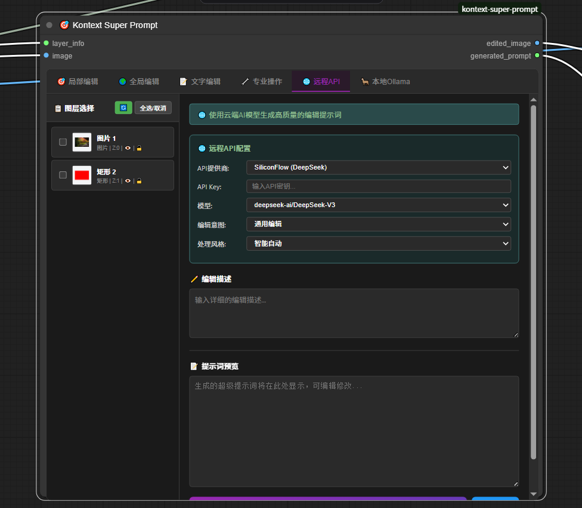

# Kontext Super Prompt

**ComfyUI图像编辑与智能提示词生成工具集** - 专业的可视化编辑与AI增强提示词生成


## 🎯 主要功能

### 🎨 LRPG Canvas  
可视化画布标注工具，提供专业的图层管理和绘制功能
- 多种绘制工具：画笔、形状、文字、裁切等
- 画笔羽化效果：支持1-20像素可调羽化半径
- 图层管理：添加、删除、调整顺序、修改属性
- 实时预览：画布状态实时同步
- 输出结构化图层数据供下游节点使用


### 🎯 Kontext Super Prompt
智能提示词生成器，将图层信息转换为结构化编辑指令
- **六种编辑模式**：
  - 局部编辑：针对特定区域的精确编辑
  - 全局编辑：整体图像风格和效果调整
  - 文字编辑：文本内容的添加和修改
  - 专业操作：高级图像处理功能
  - 远程API：集成云端AI模型
  - 本地Ollama：使用本地大语言模型
- **40+操作模板**：颜色变换、物体移除、背景替换、风格转换等
- **智能提示词生成**：自动生成约束和修饰提示词
- **英文输出保证**：所有模式强制输出英文提示词


## 💬 AI增强功能

### 🌐 远程API集成
直接在界面中使用云端AI服务：
- **支持平台**：OpenAI、Gemini、DeepSeek、Zhipu、Moonshot、SiliconFlow
- **模型选择**：自动获取最新可用模型列表
- **智能处理**：自动优化和清理AI响应
- **使用方式**：在远程API选项卡输入API密钥和描述即可



### 🦙 本地Ollama集成
使用本地大语言模型处理：
- **服务管理**：一键启动/停止Ollama服务
- **模型管理**：自动检测可用模型
- **资源优化**：智能释放GPU内存
- **隐私保护**：完全本地运行，无需联网

## 🤖 引导词系统

### 预设模式
- **Commercial Production Mode**：商业生产，适合批量处理
- **Marketing & Social Media Mode**：营销社媒，注重视觉吸引力
- **E-commerce Product Mode**：电商产品，精确的产品展示

### 专业模板（12种场景）
电商产品、社交媒体、营销活动、专业肖像、生活方式、美食摄影、房地产、时尚零售、汽车展示、美妆化妆品、企业品牌、活动摄影

### 编辑意图类型
颜色修改、物体移除、物体替换、背景更换、质量增强、风格转换、文字编辑、光线调整

### 处理风格选项
产品目录、社交媒体、企业形象、时尚、美食、房地产、汽车、美妆

## 📋 使用方法

### 基础工作流
1. 添加`🎨 LRPG Canvas`节点，连接图像输入
2. 在画布上标注需要编辑的区域
3. 添加`🎯 Kontext Super Prompt`节点
4. 选择编辑模式和操作类型
5. 生成编辑指令或使用AI增强功能

### 节点连接
```
[图像输入] → [LRPG Canvas] → [Kontext Super Prompt] → [输出提示词]
                    ↓                    ↓
                [标注图像]          [图层信息]
```

### 使用建议

#### 不同场景选择
- **产品图片**：选择"电商产品"模板 + "产品目录"风格
- **营销海报**：选择"营销社媒"模式 + "社交媒体"风格  
- **企业宣传**：选择"商业生产"模式 + "企业形象"风格

#### API使用说明
1. 在对应平台获取API密钥
2. 在远程API选项卡输入密钥
3. 选择模型（系统会自动获取可用模型）
4. 输入编辑描述，点击生成

#### Ollama使用说明
1. 确保已安装Ollama
2. 点击启动服务按钮
3. 选择本地模型
4. 输入描述，生成提示词

## 🛠️ 安装

### 方法1：通过ComfyUI Manager（推荐）
1. 打开ComfyUI Manager
2. 搜索 "Kontext Super Prompt"
3. 点击安装

### 方法2：Git克隆
```bash
cd ComfyUI/custom_nodes
git clone https://github.com/aiaiaikkk/kontext-super-prompt.git
```

### 方法3：手动安装
1. 下载项目ZIP文件
2. 解压到 `ComfyUI/custom_nodes/` 目录
3. 重启ComfyUI

## 📦 依赖要求

- ComfyUI (最新版本)
- Python 3.8+
- PyTorch 1.12+
- Ollama (可选，用于本地模型)

## 🚀 快速开始

1. **安装节点包**：通过上述任一方法安装
2. **重启ComfyUI**：确保节点正确加载
3. **添加节点**：在节点菜单中找到 "kontext_super_prompt" 分类
4. **创建工作流**：按照使用方法连接节点
5. **开始使用**：标注图像，生成提示词

## 📖 文档

- [安装指南](INSTALLATION.md)
- [示例工作流](examples/)

## 🔗 链接

- [GitHub仓库](https://github.com/aiaiaikkk/kontext-super-prompt)
- [问题反馈](https://github.com/aiaiaikkk/kontext-super-prompt/issues)

---

**Version**: 1.3.4