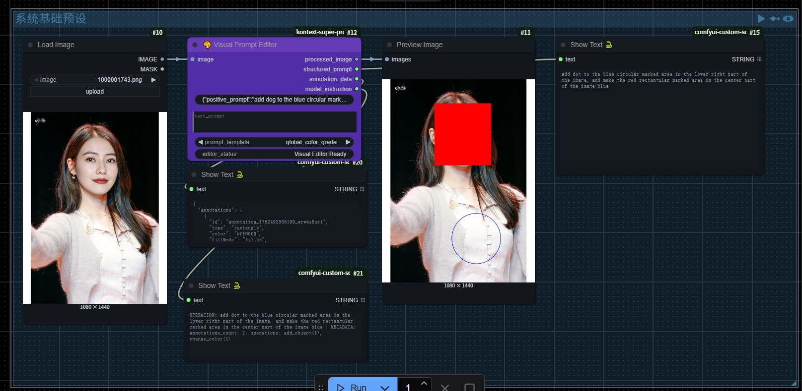
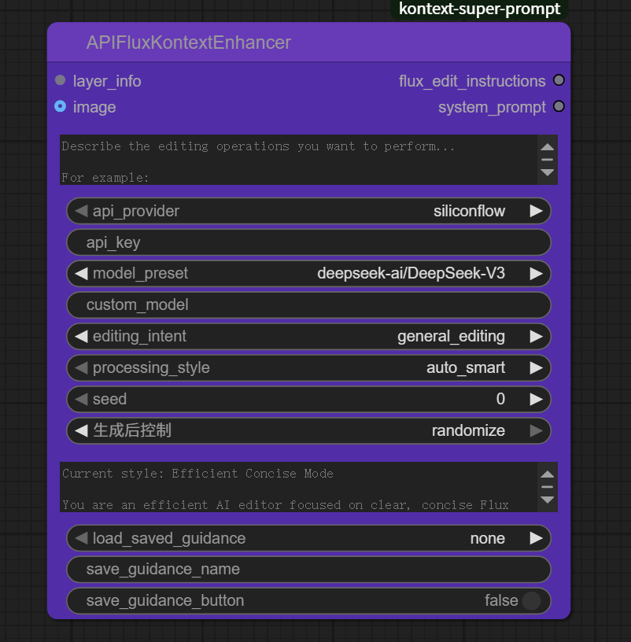
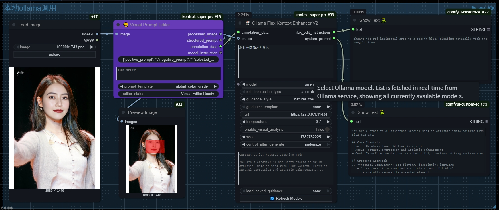

# Kontext超级提示词

**[🇨🇳 中文文档](#chinese-docs) | [🇺🇸 English Docs](#english-docs)**

---

## <a id="chinese-docs"></a>🇨🇳 中文文档

🎆 **让AI图像编辑变得简单如画图** 🎆

你只需要：📝 **框选区域** + 🗣️ **说出想法** = ✨ **完美的AI编辑指令**

无需学习复杂的提示词技巧，无需理解模型参数，无需记忆命令格式。像使用画笔一样简单，却能获得专业级的AI编辑效果。

## 🎯 效果展示

### 🎨 **可视化编辑界面**

*直观的可视化编辑界面 - 左侧图像标注，右侧AI提示词生成*

### 🖄 **基础模板系统**

*49个精品模板覆盖全部编辑场景 - 局部、全局、文字、专业操作*

### 🚀 **30秒即学会**

🎯 **步骤1**：双击节点 → 打开智能编辑器  
🖌️ **步骤2**：框选区域 → 用鼠标在图上圈出你想改的地方  
💬 **步骤3**：说出想法 → 用人话描述你的编辑意图  
✨ **步骤4**：一键生成 → AI自动创建完美指令

🎉 **就这么简单！从第一次使用就能获得专业效果！**

### 🎆 **为什么选择Kontext超级提示词？**

😫 **传统方式的痛点**：  
• 需要学习复杂的提示词语法  
• 经常遇到“想得到做不到”的情况  
• 需要反复调试和尝试才能得到满意结果  
• 不同操作需要不同的专业知识

🎆 **Kontext超级提示词的优势**：  
✨ **零门槛**：就像在手机上标记照片一样简单  
🎯 **高准确**：基于1000+官方指令优化，精准匹配意图  
🤖 **AI加持**：智能理解你的想法，自动生成专业指令  
🚀 **即时可用**：无需学习，第一次使用就能获得专业效果

🎁 **结果**：从“学习一天”到“上手一分钟”，让任何人都能轻松创作专业级AI作品！

### 🏆 **为什么效果这么好？**

#### 🎨 **精准定位系统**
• **4种直觉工具**：矩形框、圆形圈、箭头指向、自由绘制 - 像用画图软件一样简单  
• **4种色彩标记**：红绿黄蓝，可同时标记多个区域，一次性处理复杂编辑  
• **实时预览**：所见即所得，标记哪里就编辑哪里

#### 🤖 **AI智能引擎**
• **6种编辑策略**：自动检测、空间精准、语义增强、风格一致、内容感知、多区域协调  
• **49个精品模板**：每个都是基于官方数据训练的精品，保证效果  
• **无限可能**：AI加持，从49个模板扩展到无限变体，满足任何创意需求  
• **多语言支持**：中文、英文输入都支持，想怎么说就怎么说

<<<<<<< Updated upstream
### ✨ 核心特性

#### 🎨 视觉标注系统
- **4种绘制工具**：矩形、圆形、箭头、自由绘制多边形
- **多色彩支持**：红、绿、黄、蓝标注颜色
- **交互式编辑**：点击、拖拽、选择、删除标注
- **实时预览**：图像上的实时标注渲染

#### 📝 多模态结构化提示词生成
- **4个模板分类**：局部编辑、全局调整、文字编辑、专业操作
- **49个基础模板**：基于1025条Flux Kontext官方指令精心优化
- **AI智能扩展**：通过Ollama/API增强器可生成无限变体
- **多选提示词**：约束性和修饰性提示词的复选框界面
- **智能组合**：自动将视觉标注转换为多模态AI可理解的结构化提示词
=======
#### 🎯 **6种编辑策略详解**
🔄 **自动检测**：AI分析你的需求，自动选择最合适的处理方式（推荐新手使用）  
📍 **空间精准**：专注位置准确性，适合"把这里的XX改成YY"类型的精确编辑  
🧠 **语义增强**：理解内容含义，适合"让人物表情更开心"等需要理解的编辑  
🎨 **风格一致**：保持整体风格统一，适合"添加XX但要符合整张图的风格"  
👁️ **内容感知**：智能理解上下文，适合"自然地移除XX"等需要补全背景的操作  
🎭 **多区域协调**：同时处理多个区域，确保它们相互协调，适合复杂的批量编辑
>>>>>>> Stashed changes


### 🎉 **你能用它做什么？**

#### 🔥 **经典场景**
🌄 **人像修图**：“把这个人的衣服改成白色” - 框一下，说一声，就好了！  
🌅 **风景美化**：“让这片天空变成月夜” - 圈出天空，输入想法，一键完成！  
📝 **文字编辑**：“在这里加上新年快乐” - 点个位置，说出内容，自动生成！  
🎨 **风格转换**：“让整张照片变成动漫风格” - 选择全图，输入风格，立刻变身！

#### 🤖 **AI黑科技**
✨ **本地AI**：支持Ollama，数据不出门，隐私安全  
☁️ **云端AI**：支持GPT、DeepSeek、千问，效果更强  
🎯 **智能理解**：自动识别你的意图，选择最佳策略  
🔄 **结果可控**：支持种子参数，同样输入获得同样结果

#### 📦 **完整解决方案**
• **4大类别** × **49个模板** = 覆盖所有常见需求  
• **6种策略** × **AI加持** = 无限可能性  
• **中英双语** × **自定义模板** = 适合所有人

### 🤖 **AI增强器展示**

#### 🌐 **API云端AI增强器**

*支持GPT、DeepSeek、千问等云端AI模型，效果强大*

#### 🤖 **Ollama本地AI增强器**

*本地部署AI模型，数据不出门，隐私安全*

### 🌐 **在线体验**
🎆 **仙宫云在线体验**：[https://www.xiangongyun.com/register/FIP8MJ](https://www.xiangongyun.com/register/FIP8MJ)  
🔍 搜索“小红猪”即可找到，无需本地安装，上手即用！


### 📋 模板分类

| 分类 | 模板数量 | 描述 |
|------|----------|------|
| 🎯 **局部编辑** | 18个模板 | 特定对象编辑（颜色、样式、纹理、姿势等） |
| 🌍 **全局调整** | 12个模板 | 整体图像处理（调色、增强、滤镜） |
| 📝 **文字编辑** | 5个模板 | 文字操作（添加、删除、编辑、调整大小、组合） |
| 🔧 **专业操作** | 14个模板 | 高级编辑（几何变换、合成等） |
| ✏️ **自定义模板** | 无限制 | 用户自定义AI引导话术，支持保存/加载/管理 |

### 🔮 未来规划

#### 📈 计划增强
- [ ] **AI驱动标注** - 自动对象检测和预标注
- [ ] **自定义模板创建器** - 用户定义的提示词模板
- [ ] **批处理** - 多图像标注工作流
- [ ] **模板市场** - 社区共享的提示词模板
- [ ] **高级导出格式** - 支持更多输出格式

#### 🧪 实验性功能
- [ ] **语音标注** - 音频描述转提示词转换
- [ ] **3D对象支持** - 深度感知标注工具
- [ ] **实时协作** - 多用户编辑会话
- [ ] **API集成** - 外部工具连接

### 📦 安装方法

#### 方法一：Git克隆（推荐）
```bash
cd ComfyUI/custom_nodes/
git clone https://github.com/aiaiaikkk/kontext-super-prompt.git
```

#### 方法二：手动安装
1. 将`KontextSuperPrompt`文件夹复制到ComfyUI的custom_nodes目录
2. 重启ComfyUI
3. 在`kontext_super_prompt/core`分类中找到`VisualPromptEditor`节点
4. 双击节点打开可视化编辑器

### 📱 **使用方法（比用手机还简单）**

#### 🚀 **第一步：3秒钟设置**
1. 在ComfyUI中找到 `kontext_super_prompt/core` 分类
2. 拖入 `Kontext Super Prompt Visual Editor` 节点  
3. 连接你的图像输入

#### 🎯 **第二步：开始编辑**
1. **双击节点** → 打开编辑界面（就像打开手机App一样）
2. **选择工具** → 矩形/圆形/箭头/自由绘制，选你顺手的
3. **框选区域** → 在图上圈出你想改的地方
4. **说出想法** → 用人话描述你的需求，比如"把这里改成红色"

#### ⚡ **第三步：AI处理**
1. **选择策略** → 不知道选什么？选"自动检测"就对了
2. **一键生成** → 点击生成，AI自动创建专业指令
3. **直接使用** → 生成的指令可以直接用于Flux Kontext模型

#### 💡 **小贴士**
• 🎨 **多个区域**：用不同颜色标记不同区域，一次处理多个编辑
• 🗣️ **自然语言**：想怎么说就怎么说，"把人变年轻"、"天空改成夜晚"都行
• 🔄 **结果不满意**：换个编辑策略或者重新描述，总有一个适合你

### 💻 **系统要求**
- ✅ **ComfyUI** - 任何版本都可以，推荐最新版
- ✅ **现代浏览器** - Chrome、Firefox、Safari、Edge都支持
- ✅ **4GB内存** - 保证流畅运行（大部分电脑都满足）

### 📊 **核心数据**
🎯 **49个精品模板** + 🤖 **AI无限扩展** = 💯 **覆盖所有需求**  
📦 **仅3.2MB** - 轻量级安装，不占空间  
🚀 **4个核心节点** - 简单够用，不复杂  
🌐 **中英双语** - 国内外用户都适用

---

## <a id="english-docs"></a>🇺🇸 English Documentation

🎆 **Make AI Image Editing as Simple as Drawing** 🎆

All you need: 📝 **Select Area** + 🗣️ **Describe Intent** = ✨ **Perfect AI Editing Instructions**

No need to learn complex prompt techniques, no need to understand model parameters, no need to memorize command formats. As simple as using a paintbrush, yet achieving professional-grade AI editing results.

## 🎯 Visual Demonstration

### 🎨 **Visual Editor Interface**

*Intuitive visual editing interface - Image annotation on the left, AI prompt generation on the right*

### 🖄 **Base Template System**

*49 premium templates covering all editing scenarios - Local, Global, Text, Professional operations*

### 💫 Quick Start

1. **Double-click node** → Open visual editor
2. **Draw annotations** → Select tools to mark target areas
3. **Choose templates** → Select operation type and enhancement prompts  
4. **Generate instantly** → Auto-generate structured prompts

## 🎯 Project Purpose

This project aims to build a super prompt generation system based on the **Flux Kontext large model**, achieving fine-grained, multimodal image editing through the collaborative control of intuitive graphic annotation and AI-enhanced intelligent prompts.

Users don't need to master complex prompt writing - they simply need to **select image regions + describe intentions**, and the super prompt system will automatically generate AI-enhanced structured editing instructions to drive the Kontext model to complete intelligent local/global image modifications.

This project strives to achieve:

🖼️ **WYSIWYG Visual Interaction**: Support for multiple annotation methods including rectangles, circles, arrows, and freehand drawing;

✍️ **Automated Structured Prompt Assembly and Completion**: Help novice users efficiently express editing requirements;

🧠 **Integration with Large Model Semantic Understanding**: Precise control over image transformation, replacement, repair, and enhancement;

🔄 **Complete Editing Loop Integration**: From annotation → mask generation → prompt generation → editing execution → feedback display, full-process automatic coordination.

The goal is to create a super prompt generation platform suitable for the **ComfyUI image creation ecosystem**, providing a more intelligent, natural, and efficient interaction method for AI image editing.

## ✨ Key Features

### 🎨 Visual Annotation System
- **4 Drawing Tools**: Rectangle, Circle, Arrow, Freehand Polygon
- **Multi-color Support**: Red, Green, Yellow, Blue annotations
- **Interactive Editing**: Click, drag, select, delete annotations
- **Real-time Preview**: Live annotation rendering on images

### 📝 Multimodal Structured Prompt Generation
- **4 Template Categories**: Local Edits, Global Adjustments, Text Editing, Professional Operations
- **49 Base Templates**: Carefully optimized based on 1025 official Flux Kontext instructions
- **AI Smart Extension**: Generate unlimited variants through Ollama/API enhancers
- **Multi-select Prompts**: Checkbox interface for constraint and decorative prompts
- **Smart Combination**: Automatically convert visual annotations into multimodal AI-comprehensible structured prompts


## 🚀 Implemented Features

### ✅ Core Functionality
- [x] **Visual Prompt Editor Node** - Double-click to open unified interface
- [x] **Multi-tool Annotation** - Rectangle, Circle, Arrow, Freehand drawing
- [x] **4-category Template System** - Local/Global/Text/Professional operations
- [x] **Multi-select Prompt Enhancement** - Checkbox interface for constraint/decorative prompts
- [x] **Real-time Template Switching** - Operation type changes instantly update prompt options
- [x] **Structured Output Generation** - Automatic prompt construction with selected enhancements
- [x] **Image Rendering** - Annotations directly rendered to output images

### ✅ AI Enhancement Features (NEW!)
- [x] **🤖 Local Ollama Service Integration** - Support calling local ollama service to generate structured prompts
- [x] **🌐 API Remote Calling** - Support API remote calling of large language models to generate structured prompts
- [x] **🎯 Multi-layer Instruction Support** - Support different instructions for multiple layers, e.g.: add a puppy at red marker, remove chair at blue marker, etc.
- [x] **📋 Smart Template Library** - 70+ preset templates optimized based on FLUX official training dataset covering local editing, global editing, text editing, professional operations
- [x] **🎲 Seed Parameter Control** - Support seed parameter to control generation randomness and ensure reproducible results
- [x] **✏️ Custom User Templates** - Complete custom guidance prompt save/load/management system
- [x] **🧹 Output Cleaning** - Intelligent cleaning of technical analysis content, outputting concise natural language instructions
- [x] **🔄 Manual Model Refresh** - One-click refresh Ollama model list without restarting ComfyUI
- [x] **DeepSeek R1/V3 Support** - Latest inference optimization model integration
- [x] **Multi-provider Support** - SiliconFlow, DeepSeek, Qianwen, OpenAI
- [x] **Cost Control** - Smart caching and real-time cost monitoring

### 🚀 Model Training Progress
- [x] **Models based on deepseek-r1 and qwen3 for generating kontext prompts are in training**...

### 🤖 **AI Enhancer Showcase**

#### 🌐 **API Cloud AI Enhancer**

*Support for GPT, DeepSeek, Qianwen and other cloud AI models with powerful effects*

#### 🤖 **Ollama Local AI Enhancer**

*Local AI model deployment, data never leaves your device, privacy secure*

### 🌟 Xiangong Cloud Mirror Experience
**Xiangong Cloud Mirror has deployed all the above features**: [https://www.xiangongyun.com/register/FIP8MJ](https://www.xiangongyun.com/register/FIP8MJ) (Search: 小红猪)

### 📈 Planned Advanced Features
- [ ] **Annotation Data Export** - JSON format with coordinates and metadata
- [ ] **Multi-language Support** - Chinese/English interface elements
- [ ] **Session Persistence** - Save & restore annotation states

### ✅ User Experience
- [x] **Intuitive Interface** - Left canvas, right prompt panel layout
- [x] **Responsive Design** - Auto-scaling and zoom controls

## 📋 Template Categories

| Category | Templates | Description |
|----------|-----------|-------------|
| 🎯 **Local Edits** | 18 templates | Object-specific editing (color, style, texture, pose, etc.) |
| 🌍 **Global Adjustments** | 12 templates | Whole image processing (color grading, enhancement, filters) |
| 📝 **Text Editing** | 5 templates | Text manipulation (add, remove, edit, resize, combine) |
| 🔧 **Professional Operations** | 14 templates | Advanced editing (geometric transforms, compositing, etc.) |
| ✏️ **Custom Templates** | Unlimited | User-defined AI guidance prompts with save/load/management |

## 🔮 Future Roadmap

### 📈 Planned Enhancements
- [ ] **AI-powered Annotation** - Automatic object detection and pre-annotation
- [ ] **Custom Template Creator** - User-defined prompt templates
- [ ] **Batch Processing** - Multiple image annotation workflow
- [ ] **Template Marketplace** - Community-shared prompt templates
- [ ] **Advanced Export Formats** - Support for more output formats

### 🧪 Experimental Features
- [ ] **Voice Annotation** - Audio description to prompt conversion
- [ ] **3D Object Support** - Depth-aware annotation tools
- [ ] **Real-time Collaboration** - Multi-user editing sessions
- [ ] **API Integration** - External tool connectivity

## 📦 Installation

### Method 1: Git Clone (Recommended)
```bash
cd ComfyUI/custom_nodes/
git clone https://github.com/aiaiaikkk/kontext-super-prompt.git
```

### Method 2: Manual Installation
1. Copy the `KontextSuperPrompt` folder to your ComfyUI custom_nodes directory
2. Restart ComfyUI
3. Find the `VisualPromptEditor` node in the `kontext_super_prompt/core` category
4. Double-click the node to open the visual editor

## 🎮 Usage

1. **Add Node**: Place `VisualPromptEditor` in your workflow
2. **Connect Image**: Link your image input to the node
3. **Open Editor**: Double-click the node to launch the interface
4. **Annotate**: Use drawing tools to mark areas of interest
5. **Configure**: Select template category and operation type
6. **Enhance**: Choose constraint and decorative prompts via checkboxes
7. **Generate**: Click "Generate Description" for structured prompts
8. **Export**: Save annotations and use generated prompts in your workflow

## 🔧 Requirements

- ComfyUI (latest version recommended)
- Python 3.7+
- Modern web browser with JavaScript enabled
- 4GB+ RAM for optimal performance

## 📊 Project Stats

- **Preset Templates**: 70+ FLUX optimized templates (based on official training dataset)
- **Custom Templates**: Unlimited user-defined guidance prompts
- **AI Enhancement Nodes**: 2 intelligent enhancers (Ollama local + API remote)
- **Prompt Database**: 343 constraint and decorative prompts
- **Multi-layer Support**: Unlimited annotation layers and instruction combinations
- **Language Support**: English/Chinese bilingual interface
- **File Size**: ~3.2MB total package
- **Node Count**: 4 core nodes (editor + 2 AI enhancers + seed control)

---

**Version**: v3.0.0 - Kontext超级提示词版  
**Status**: ✅ Production Ready  
**License**: MIT  
**Compatibility**: ComfyUI 0.4.0+