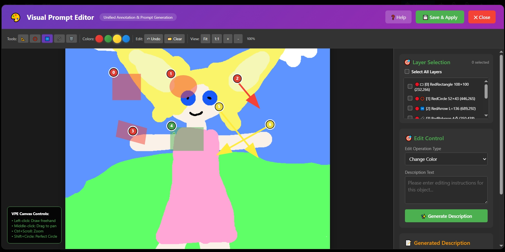

# Kontext Visual Prompt Window / Kontext 可视化提示词窗口

**English** | [中文](#中文版本)

An intelligent visual prompt generation system for ComfyUI that automatically transforms simple user inputs into professional, structured prompts for AI image editing. No prompt engineering knowledge required.

一个智能的ComfyUI可视化提示词生成系统，自动将用户的简单输入转换为专业的结构化AI图像编辑提示词。无需提示词工程知识。

## 🎯 Core Concept / 核心概念

**English**: Transform simple visual selections into professional, structured prompts for multimodal AI models. Users only need to click and select - the system automatically generates precise, technical prompts optimized for AI image editing.

**中文**: 将简单的视觉选择转换为专业的结构化提示词。用户只需点击选择，系统自动生成精确的、针对AI图像编辑优化的技术提示词。

## ⭐ **Key Innovation: Structured Prompt Automation / 核心创新：结构化提示词自动化**



**English**: 
- 🎯 **Simple Input**: Click objects, choose operation type, add basic description
- 🤖 **AI Enhancement**: Large language models automatically expand into professional prompts  
- 📝 **Structured Output**: Complete technical prompts with constraints, quality markers, and context
- ⚡ **Zero Learning Curve**: No prompt engineering knowledge required

**中文**:
- 🎯 **简单输入**: 点击物体，选择操作类型，添加基础描述
- 🤖 **AI增强**: 大语言模型自动扩展为专业提示词
- 📝 **结构化输出**: 完整的技术提示词，包含约束、质量标记和上下文
- ⚡ **零学习成本**: 无需提示词工程知识

## 📋 Intended Functionality / 预期功能

### 🤖 **Smart Annotation System / 智能标注系统**
**English**:
- **Auto-detection**: Intelligent object detection using ComfyUI's built-in models (YOLO, SAM)
- **Manual annotation**: Rectangle, circle, arrow, and freehand polygon tools
- **Hybrid workflow**: AI pre-annotation + manual refinement for maximum accuracy

**中文**:
- **自动检测**: 使用ComfyUI内置模型(YOLO, SAM)进行智能物体检测
- **手动标注**: 矩形、圆形、箭头和自由多边形绘制工具
- **混合工作流**: AI预标注 + 手动精修，确保最高准确度

### 🎨 **Visual Editing Interface / 可视化编辑界面**
**English**:
- **Double-click activation**: Open visual editor by double-clicking any VisualPromptEditor node
- **Universal image support**: Works with LoadImage, Router, Reroute, Preview Bridge, and any processing chain
- **Multi-layer management**: Select single or multiple annotation objects
- **Real-time preview**: Live annotation rendering with zoom and pan controls

**中文**:
- **双击激活**: 双击任意VisualPromptEditor节点打开可视化编辑器
- **通用图像支持**: 兼容LoadImage、Router、Reroute、Preview Bridge等所有处理链
- **多图层管理**: 支持单选或多选标注对象
- **实时预览**: 带缩放和平移控制的实时标注渲染

### 📝 **Structured Prompt Generation / 结构化提示词自动生成**
**English**:
- **Simple User Input**: Users provide basic instructions like "change color to red" or "make it bigger"
- **Automatic Expansion**: System automatically generates professional prompts with technical details
- **LLM Enhancement**: Large language models refine prompts for optimal AI model performance
- **Template Intelligence**: Smart template selection and customization based on context
- **Quality Optimization**: Automatic addition of quality markers, constraints, and best practices
- **Multi-object Coordination**: Intelligently handle complex multi-object editing scenarios

**中文**:
- **简单用户输入**: 用户只需提供基础指令如"改成红色"或"变大一些"
- **自动扩展**: 系统自动生成包含技术细节的专业提示词
- **LLM增强**: 大语言模型优化提示词以获得最佳AI模型性能
- **智能模板**: 基于上下文的智能模板选择和定制
- **质量优化**: 自动添加质量标记、约束条件和最佳实践
- **多对象协调**: 智能处理复杂的多对象编辑场景

## ✅ Currently Implemented / 已实现功能

### **Core Features (100% Complete) / 核心功能 (100% 完成)**
**English**:
- ✅ **Universal Image Acquisition**: Supports all ComfyUI image node types
- ✅ **Visual Annotation Tools**: Rectangle, circle, arrow, freehand polygon drawing
- ✅ **Multi-selection Support**: Select and combine multiple annotation objects
- ✅ **Canvas Controls**: Zoom, pan, fit-to-screen functionality
- ✅ **Real-time Rendering**: Live annotation display with transparency and colors
- ✅ **Data Persistence**: Save/load annotation data between sessions

**中文**:
- ✅ **通用图像获取**: 支持所有ComfyUI图像节点类型
- ✅ **可视化标注工具**: 矩形、圆形、箭头、自由多边形绘制
- ✅ **多选支持**: 选择和组合多个标注对象
- ✅ **画布控制**: 缩放、平移、适应屏幕功能
- ✅ **实时渲染**: 带透明度和颜色的实时标注显示
- ✅ **数据持久化**: 会话间保存/加载标注数据

### **Architecture (Fully Modular) / 架构设计 (完全模块化)**
**English**:
- ✅ **Modular Frontend**: 5 specialized modules for UI, canvas, annotations, prompts, utils
- ✅ **Clean Backend**: 3 core nodes - annotation, editing, mask conversion
- ✅ **Zero Dependencies**: Pure JavaScript frontend, internal ComfyUI integration
- ✅ **Debug System**: Comprehensive logging and error handling

**中文**:
- ✅ **模块化前端**: 5个专门模块负责UI、画布、标注、提示词、工具
- ✅ **简洁后端**: 3个核心节点 - 标注、编辑、掩码转换
- ✅ **零依赖**: 纯JavaScript前端，内部ComfyUI集成
- ✅ **调试系统**: 全面的日志记录和错误处理

### **Workflow Integration / 工作流集成**
**English**:
- ✅ **Node Compatibility**: Works with LoadImage → Router → VisualPromptEditor chains
- ✅ **Mask Generation**: Convert annotations to ComfyUI-compatible masks
- ✅ **Template System**: 12 operation types with structured prompt templates

**中文**:
- ✅ **节点兼容性**: 支持LoadImage → Router → VisualPromptEditor链条
- ✅ **掩码生成**: 将标注转换为ComfyUI兼容的掩码
- ✅ **模板系统**: 12种操作类型和结构化提示词模板

## 🔧 Basic Usage (Current) / 基本使用方法 (当前版本)

### **Interface Preview / 界面预览**

*The visual annotation interface with drawing tools, canvas controls, and structured prompt generation*

### **Simple Workflow / 简单工作流**
```
LoadImage → VisualPromptEditor
```

### **Advanced Workflow / 高级工作流**
```
LoadImage → Router → VisualPromptEditor → LayerToMask → [Your AI Model]
```

### **Operation Steps / 操作步骤**
**English**:
1. Connect an image source to VisualPromptEditor node
2. Double-click the node to open visual editor
3. Use annotation tools to mark areas of interest
4. Select objects and choose operation type
5. Generate structured prompts for your editing task
6. Save annotations and apply to workflow

**中文**:
1. 将图像源连接到VisualPromptEditor节点
2. 双击节点打开可视化编辑器
3. 使用标注工具标记感兴趣的区域
4. 选择对象并选择操作类型
5. 为编辑任务生成结构化提示词
6. 保存标注并应用到工作流

## 🚀 Next Steps: LLM Integration / 下一步计划：LLM集成

### **Planned LLM Features / 计划中的LLM功能**

#### **🧠 Intelligent Prompt Enhancement / 智能提示词自动增强**
**English**:
- **Simple to Professional**: Transform basic user input "make it red" → "Change the selected object's color to vibrant red while maintaining original lighting, shadows, and material properties. Ensure seamless integration with surrounding environment and preserve natural appearance."
- **Context Understanding**: LLM analyzes image content, object relationships, and spatial context
- **Technical Expansion**: Automatically add professional constraints, quality markers, and best practices
- **Model Optimization**: Auto-adapt prompts for specific AI models (FLUX, SDXL, Midjourney, etc.)
- **Error Prevention**: Include negative prompts and constraints to prevent common generation issues

**中文**:
- **简单变专业**: 将基础输入"变成红色"→"将选中物体的颜色改为鲜艳的红色，同时保持原有的光照、阴影和材质属性。确保与周围环境无缝融合，保持自然外观。"
- **上下文理解**: LLM分析图像内容、物体关系和空间上下文
- **技术扩展**: 自动添加专业约束、质量标记和最佳实践
- **模型优化**: 自动适配特定AI模型的提示词(FLUX, SDXL, Midjourney等)
- **错误预防**: 包含负面提示词和约束以防止常见生成问题

#### **📝 Advanced Prompt Generation / 高级结构化提示词自动生成**
**English**:
- **One-Click Professional Prompts**: Click object + simple instruction → Complete professional editing prompt
- **Smart Template System**: Auto-select optimal prompt templates based on operation type and context
- **Multi-object Intelligence**: Automatically coordinate prompts for complex multi-object scenarios
- **Quality Assurance**: Built-in quality markers, technical constraints, and error prevention
- **Model-Specific Optimization**: Generate optimized prompts for FLUX, SDXL, Midjourney, and other models
- **Workflow Integration**: Seamlessly integrate generated prompts into ComfyUI workflows

**中文**:
- **一键专业提示词**: 点击物体 + 简单指令 → 完整的专业编辑提示词
- **智能模板系统**: 基于操作类型和上下文自动选择最优提示词模板
- **多对象智能**: 自动协调复杂多对象场景的提示词
- **质量保证**: 内置质量标记、技术约束和错误预防
- **模型专用优化**: 为FLUX、SDXL、Midjourney等模型生成优化提示词
- **工作流集成**: 生成的提示词无缝集成到ComfyUI工作流

#### **🎯 Smart Suggestions / 智能建议**
**English**:
- **Operation Recommendations**: Suggest optimal editing operations based on annotations
- **Quality Optimization**: Real-time prompt refinement for better results
- **Workflow Insights**: Provide editing workflow recommendations

**中文**:
- **操作建议**: 基于标注建议最优编辑操作
- **质量优化**: 实时提示词优化以获得更好结果
- **工作流洞察**: 提供编辑工作流建议

#### **🤖 Automatic Annotation & Semantic Segmentation / 自动标注与语义分割**
**English**:
- **Intelligent Object Detection**: Automatically identify and segment objects in images
- **Semantic Understanding**: Recognize object categories, relationships, and spatial context
- **Multi-level Segmentation**: Support for object-level, part-level, and pixel-level segmentation
- **Auto-tagging System**: Automatically generate semantic labels for detected objects
- **Smart Region Grouping**: Intelligently group related objects and regions

**中文**:
- **智能物体检测**: 自动识别并分割图像中的物体
- **语义理解**: 识别物体类别、关系和空间上下文
- **多层次分割**: 支持物体级、部件级和像素级分割
- **自动标签系统**: 为检测到的物体自动生成语义标签
- **智能区域分组**: 智能地组合相关物体和区域

### **Technical Implementation Plan / 技术实现计划**

#### **Phase 1: Automatic Annotation System / 第一阶段：自动标注系统**
**English**:
1. **Vision Model Integration**: Integrate YOLO, SAM, GroundingDINO for object detection
2. **Semantic Segmentation**: Add support for semantic segmentation models (Segment Anything, etc.)
3. **Auto-labeling Pipeline**: Build automatic object recognition and labeling system
4. **Multi-model Ensemble**: Combine multiple vision models for better accuracy
5. **Real-time Processing**: Optimize for real-time annotation generation

**中文**:
1. **视觉模型集成**: 集成YOLO、SAM、GroundingDINO进行物体检测
2. **语义分割**: 添加语义分割模型支持(Segment Anything等)
3. **自动标签管道**: 构建自动物体识别和标记系统
4. **多模型集成**: 结合多个视觉模型提高准确性
5. **实时处理**: 优化实时标注生成

#### **Phase 2: LLM Intelligence Layer / 第二阶段：LLM智能层**
**English**:
1. **LLM Service Integration**: Add support for local/cloud LLM endpoints
2. **Context Pipeline**: Build annotation → context → prompt generation pipeline  
3. **Model Adapters**: Create adapters for different LLM models (GPT, Claude, local models)
4. **Smart Templates**: Replace static templates with dynamic LLM-generated prompts
5. **Feedback Loop**: Implement result evaluation and prompt iteration

**中文**:
1. **LLM服务集成**: 添加本地/云端LLM端点支持
2. **上下文管道**: 构建 标注 → 上下文 → 提示词生成 管道
3. **模型适配器**: 为不同LLM模型创建适配器(GPT、Claude、本地模型)
4. **智能模板**: 用动态LLM生成的提示词替换静态模板
5. **反馈循环**: 实现结果评估和提示词迭代

#### **Phase 3: Advanced Features / 第三阶段：高级功能**
**English**:
1. **Multi-modal Understanding**: Combine vision and language understanding
2. **Scene Graph Generation**: Build relationships between detected objects
3. **Contextual Reasoning**: Advanced spatial and semantic reasoning
4. **Workflow Automation**: Auto-suggest complete editing workflows
5. **Quality Enhancement**: Advanced prompt optimization and validation

**中文**:
1. **多模态理解**: 结合视觉和语言理解
2. **场景图生成**: 构建检测物体间的关系
3. **上下文推理**: 高级空间和语义推理
4. **工作流自动化**: 自动建议完整的编辑工作流
5. **质量增强**: 高级提示词优化和验证

## 🛠 Installation / 安装方法

**English**:
1. Copy the entire `KontextVisualPromptWindow` folder to `ComfyUI/custom_nodes/`
2. Restart ComfyUI
3. Add VisualPromptEditor node to your workflow
4. Connect any image source and double-click to start annotating

**中文**:
1. 将整个`KontextVisualPromptWindow`文件夹复制到`ComfyUI/custom_nodes/`
2. 重启ComfyUI
3. 在工作流中添加VisualPromptEditor节点
4. 连接任意图像源，双击开始标注

## 📊 Project Status / 项目状态

**English**:
- **Current Version**: v2.2.6 (Universal Image Acquisition System)
- **Stability**: Production Ready
- **Core Features**: ✅ Complete
- **LLM Integration**: 🔄 Next Phase
- **Documentation**: ✅ Up to Date

**中文**:
- **当前版本**: v2.2.6 (通用图像获取系统)
- **稳定性**: 生产就绪
- **核心功能**: ✅ 完成
- **LLM集成**: 🔄 下一阶段
- **文档**: ✅ 最新

## 🎯 Vision / 愿景

**English**: Transform ComfyUI into an intelligent visual editing platform where users can naturally communicate their editing intentions through visual annotations, powered by advanced language models that understand both visual context and user intent.

**中文**: 将ComfyUI转变为智能的可视化编辑平台，用户可以通过视觉标注自然地表达编辑意图，由理解视觉上下文和用户意图的先进语言模型提供支持。

---

# 中文版本

## 📝 快速开始

### 界面展示

*包含绘制工具、画布控制和结构化提示词生成的可视化标注界面*

### 基本工作流
1. **加载图像**: 使用LoadImage节点或任何图像处理节点
2. **连接编辑器**: 将图像输出连接到VisualPromptEditor节点
3. **打开编辑器**: 双击VisualPromptEditor节点
4. **创建标注**: 使用绘制工具标记需要编辑的区域
5. **生成提示词**: 选择操作类型，自动生成结构化提示词

### 支持的节点类型
- ✅ LoadImage (ComfyUI官方)
- ✅ Load Image (from Outputs) (ComfyUI官方)
- ✅ Router / Reroute (路由节点)
- ✅ Preview Bridge (预览桥接)
- ✅ 任何图像处理链节点

### 下一步开发重点

#### 🤖 **第一阶段：智能自动标注**
- **自动物体检测**: 集成YOLO、SAM等模型自动识别图像中的物体
- **语义分割**: 自动进行像素级别的精确分割
- **智能标签**: 自动为检测到的物体生成语义标签
- **多模型融合**: 结合多个视觉模型提高检测准确性

#### 🧠 **第二阶段：结构化提示词AI自动生成**
- **简单输入智能扩展**: 用户输入"变红色" → AI生成"将选中物体颜色改为鲜艳红色，保持原有光照和材质，确保自然融合"
- **专业提示词自动化**: LLM自动添加技术约束、质量标记和最佳实践
- **模型专用优化**: 为不同AI模型(FLUX/SDXL/Midjourney)自动生成最优提示词
- **零学习成本**: 用户无需学习提示词工程，系统自动处理所有技术细节
- **一键生成**: 点击+简单描述 → 完整专业提示词

#### 🎯 **最终目标：零门槛AI图像编辑**
**用户体验流程**: 点击物体 → 说出简单需求 → AI自动生成专业结构化提示词 → 完美编辑效果

**技术流程**: **自动检测 → 智能标注 → 简单指令 → 结构化提示词AI生成 → 模型优化输出**

---

*为ComfyUI社区用❤️构建*